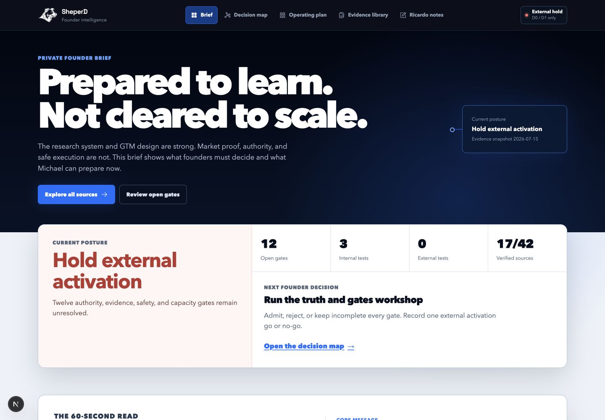
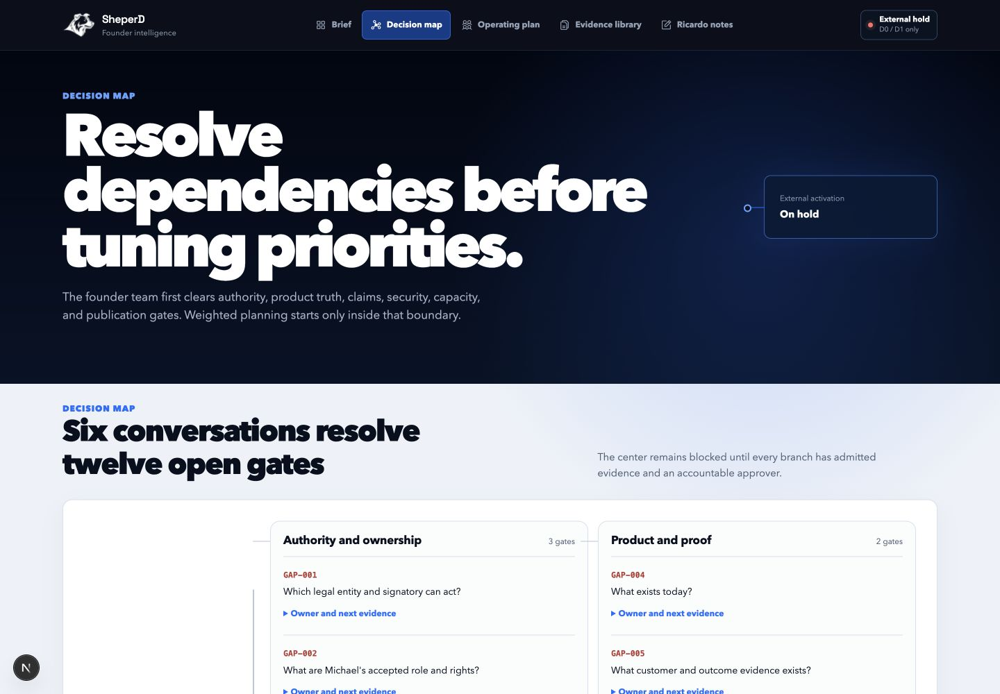
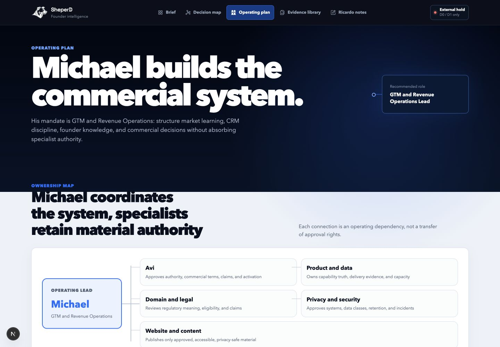
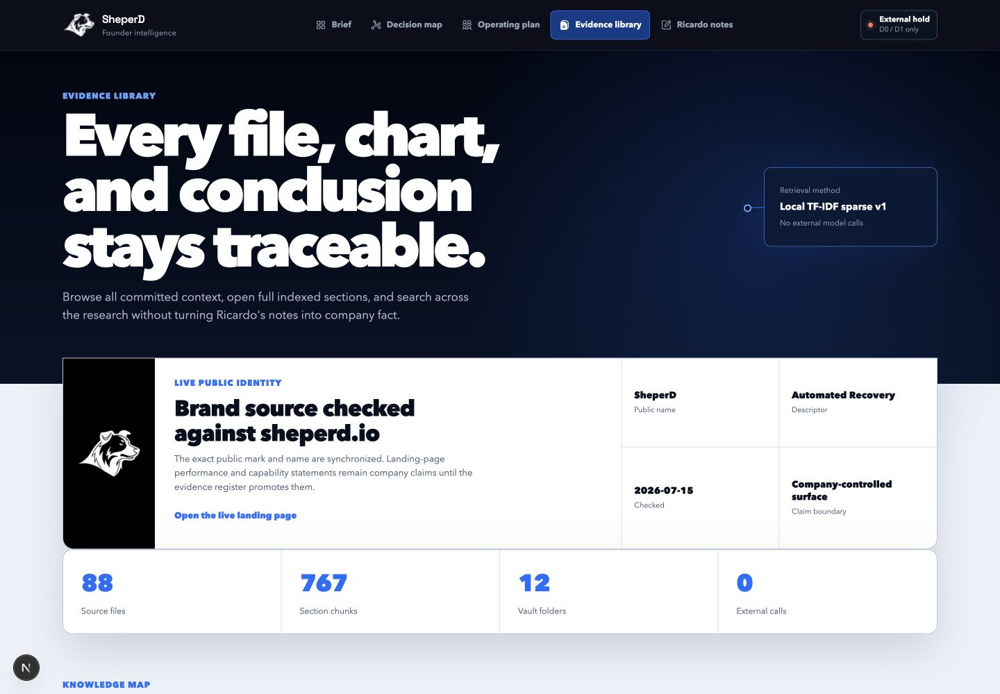
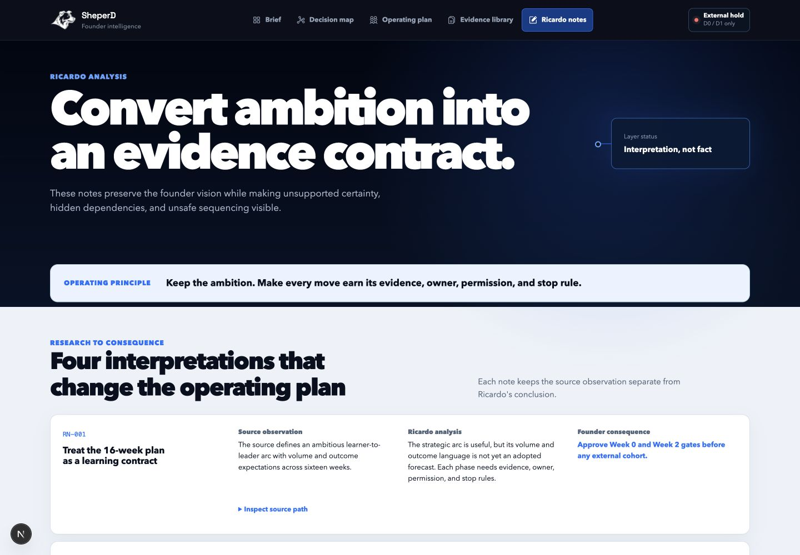
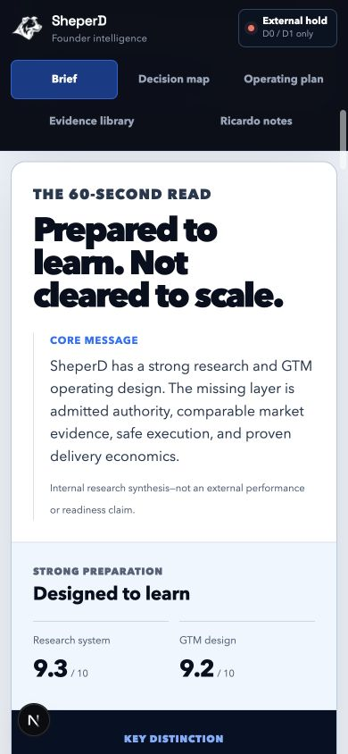
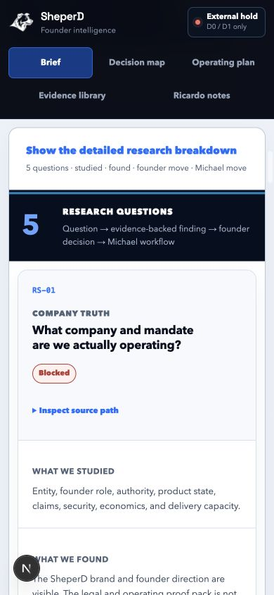

# Founder Intelligence Comprehension Audit

Audited locally on **2026-07-15** against the committed D0/D1 research snapshot.

## Audit scope

Combined UX and accessibility-risk review of the founder path:

1. Founder brief (`/`)
2. Decision map (`/improvements`)
3. Michael operating plan (`/mikey`)
4. Evidence library (`/research`)
5. Ricardo interpretation (`/ricardo`)

## User goal and accessibility target

- A founder should understand what was researched, what was found, what remains uncertain, and what decision comes next without reading the full vault.
- Michael should be able to translate the same evidence into a repeatable operating workflow without absorbing founder or specialist authority.
- The primary path must remain semantic, keyboard-compatible, responsive, and understandable without color or charts.

## Strengths confirmed

- The external hold, next founder decision, source state, and role boundaries are visible before supporting detail.
- Every interpretation keeps a source path and separates evidence from Ricardo's analysis and founder consequence.
- Charts expose exact-data alternatives; maps and process visualizations retain ordered-list or definition-list meaning.
- The complete 88-file corpus remains available after the executive summary.

## Baseline risks found

| Priority | Risk | Effect |
|---|---|---|
| P1 | The Brief explained corpus structure but did not summarize the business questions the research answered. | Founders had to infer the study narrative across several pages. |
| P1 | Michael's page explained mandate and authority but not the repeatable loop he should operate. | Role clarity did not yet become a weekly workflow. |
| P2 | The Evidence library's seven-layer map describes knowledge architecture, not the meaning of the findings. | A first-time reader could mistake corpus organization for research synthesis. |
| P1 | The strongest conclusions were accurate but distributed across the posture card, five-question synthesis, score grid, and route-specific pages. | A founder still had to scan too far before reaching the single core message and the most valuable findings. |
| P2 | The complete five-question synthesis was always expanded. | Detail remained available, but it competed with the executive path and increased page length. |
| P1 | Mobile navigation used a horizontal strip that exposed only three of five routes at once. | Evidence and Ricardo analysis were discoverable only after an unlabelled horizontal scroll. |

## Changes made

- Added a five-question synthesis: company truth, domain/problem, market learning, operating system, and AI/automation.
- Each question now shows `what we studied`, `what we found`, and separate founder and Michael consequences.
- Added the exact 45-workflow reconciliation: 8 mapped, 25 blocked, 8 need an owner, and 4 outside Michael's independent scope.
- Added Michael's five-step loop: `Admit → Route → Prepare → Execute after GO → Decide`.
- Added the admitted daily, weekly, biweekly, monthly, and formal-gate cadence.
- Replaced the generic Brief hero with the research thesis: `Prepared to learn. Not cleared to scale.`
- Added a 60-second readout that contrasts strong research/GTM preparation with weak market proof and safe readiness.
- Added five evidence-state-labelled golden nuggets covering company truth, the recovery problem, market learning, Michael's operating role, and the AI boundary.
- Kept the full five-question evidence trail and every source path behind a native disclosure, closed by default.
- Reflowed all five mobile navigation destinations into a visible two-row grid with 44-pixel minimum targets.

## Current screenshot evidence

### Step 1 — Founder brief: strong after executive compression

### Step 2 — Decision map: strong, dependency-first

### Step 3 — Michael operating plan: strong, authority remains bounded

### Step 4 — Evidence library: strong source depth, intentionally not the entry point

### Step 5 — Ricardo interpretation: strong separation of observation and analysis

### Responsive detail — mobile readout and evidence disclosure

## Accessibility evidence and limits

- Confirmed one H1 per route, ordered process semantics, definition-list metrics, native disclosure controls, and no document overflow at 390px.
- Status meaning is written in text and does not rely on color alone.
- Desktop and mobile screenshots were opened and visually inspected.
- The executive readout exposes exact score values, uses headings and definition lists, and preserves five evidence-state labels without relying on chart interpretation.
- All five navigation destinations remain visible at 390px; the navigation no longer requires horizontal scrolling.
- This review does not claim full WCAG conformance. Screen-reader announcements, full keyboard traversal, browser zoom, and independent contrast tooling remain production verification items.

## Audited steps

| Step | Surface | General health |
|---:|---|---|
| 1 | Founder brief | Strong after synthesis; current posture and research meaning are available in one path. |
| 2 | Decision map | Strong; it turns the hold state into six founder conversations and twelve explicit gates. |
| 3 | Michael operating plan | Strong after the workflow and cadence bridge; authority boundaries remain explicit. |
| 4 | Evidence library | Strong source depth; remains the proof layer rather than the executive entry point. |
| 5 | Ricardo interpretation | Strong; conclusions remain visibly separate from observations and founder decisions. |

Local screenshot evidence is stored in `.qa/comprehension-audit-2026-07-15/`.
