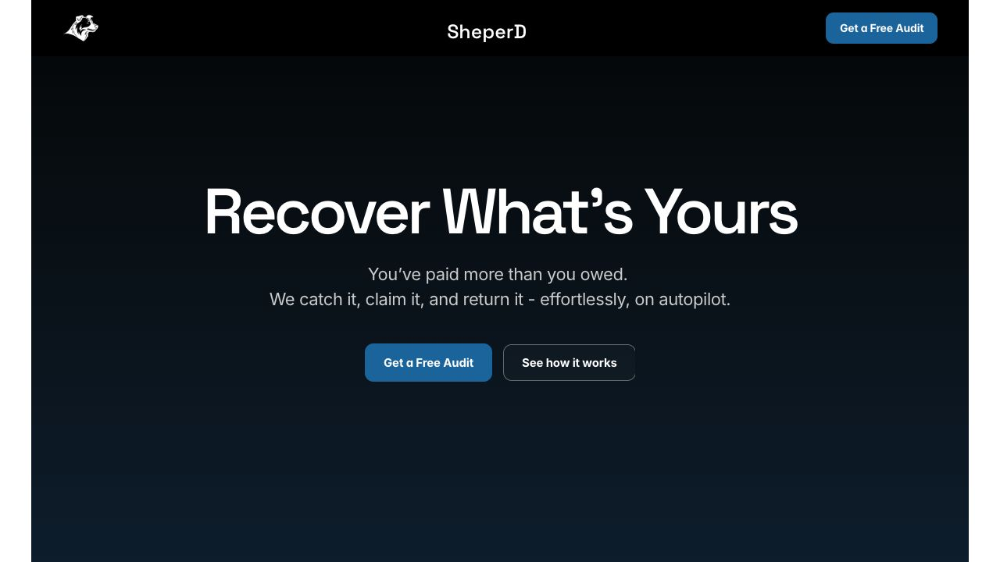

# Founder Intelligence Design System

## Live brand source

- Source URL: `https://www.sheperd.io/`
- Capture date: 2026-07-15
- Evidence: live DOM, computed styles, asset inventory, metadata, and browser screenshot
- Identity artifact: `public/brand/sheperd-dog-white.png`
- Source record: `BRAND_SOURCE.md`



Use the company-controlled landing page as the visual source of truth for the public name and logo only. Its numerical, capability, recovery, timing, entity, and commercial statements remain company claims until the canonical evidence register promotes them.

Observed brand tokens:

- Public name: **SheperD**
- Primary mark: white dog-head logo, 1039×801 source, displayed at approximately 47×36 in the live header
- Header/footer: `#000000`
- Dark field: approximately `#0a1f33`
- Primary action: `#1b6ca8`
- Display type: Space Grotesk, 600 weight, tight negative tracking
- Action/body type: Inter on the captured CTA; practical system fallbacks elsewhere
- Public voice: direct recovery language and compact action labels

The private dashboard retains its denser analytical typography and status colors. It adopts the exact mark, public-name casing, black/navy foundation, and blue action role without importing unverified marketing copy.

## Design intent

A private founder control room, not a public marketing site. The supplied SheperD reference establishes the visual language: near-black navy, electric-blue signal, crisp white analytical surfaces, compact navigation, and connected decision modules.

The product preserves that energy while prioritizing decision speed, auditability, and source retrieval.

## Design read

- Variance: 4/10
- Motion: 2/10
- Density: 5/10
- Primary accent: electric blue
- Core rhythm: dark control header and hero, then light evidence workspace

## Information hierarchy

Every primary view follows this order:

1. Page thesis and current boundary.
2. Decision or action that follows.
3. Evidence visualization or operating flow.
4. Supporting detail behind progressive disclosure.
5. Full source traceability.

The first viewport must answer two questions: what does this mean, and what should happen next. Large page titles stop at 48px, descriptions stay adjacent to their headings, and secondary data never competes with the decision.

Navigation is limited to four founder tasks: Competitors, Market, Michael, and Knowledge map.

## Visual language

- Near-black navy anchors navigation, identity, and decision posture.
- Electric blue communicates interaction, retrieval, and informational connection.
- Cool paper separates the private workspace from white evidence surfaces.
- Red means blocked or unsafe.
- Green means permitted inside the current boundary.
- Amber means a decision or approval is required.
- Panels use an 8px radius and controls use a 6px radius.
- Fine borders carry structure; shadows are reserved for the interactive graph nodes.
- The interface uses one dark-to-light theme rhythm rather than independent themed sections.
- The signature analytical element is the evidence route from claim to source. Preparation never appears as proof of demand.

## Typography

- Product copy uses the native Avenir Next stack with Segoe UI and Arial fallbacks.
- Page titles are sentence case, tightly tracked, and constrained to 32px to 48px.
- Body copy is at least 16px in decision-critical areas.
- Metadata remains legible and passes contrast requirements.
- Monospace is reserved for IDs, source paths, and numeric indices.

## Source library

- The catalog lists all 92 admitted files and keeps arbitrary filesystem paths outside the public reader.
- The generated manifest preserves resolved Obsidian wikilinks and internal Markdown links only when both ends belong to the admitted corpus.
- A document dock keeps up to four files open, stores the active tab in the URL, and never retrieves an unadmitted path.
- Lexical search returns sourced passages only and links every result to its full admitted document.
- Search never upgrades evidence, generates claims, or hides an empty, malformed, or network-error state.
- The selected file exposes its admitted path, indexed word count, section count, evidence state, and retrievable sections.

## Visualization rules

- The competitor chart communicates one positioning hypothesis and carries an explicit evidence boundary.
- The market route is a semantic ordered list with source-backed proof signals.
- The knowledge graph shows the active file, its outgoing links, and its backlinks using only admitted file-to-file edges. One-step and bounded two-step views prevent the graph from becoming an unreadable folder diagram.
- The graph is paired with a four-tab reader, relationship lists, search, and a semantic file index so it is never the only route to a source.
- Dense provider, source, and workstream detail uses progressive disclosure where hiding it improves the default scan.
- Michael's action block keeps owner, approver, completion evidence, and source visible without interaction.

## Interaction and accessibility

- All primary interactive targets are at least 42px tall, with 44px preferred.
- Focus states use a visible 3px blue outline.
- Active mobile navigation scrolls inside its own rail and never shifts the document.
- Motion respects `prefers-reduced-motion`; chart animation is disabled for reduced-motion users.
- Semantic meaning does not depend on color alone.
- Full source paths remain selectable and copyable.

## Responsive behavior

- Wide screens use a compact sticky top control bar and a centered 1180px workspace.
- Tablet screens preserve all four navigation choices in one task row.
- Small screens use a compact identity row plus a horizontally scrollable task rail that centers the active view.
- Charts, maps, signals, workstreams, and search results collapse without horizontal page overflow.
- The document dock keeps its tabs horizontally scrollable and shows one readable source at a time on small screens.
- The semantic file index remains available below the graph for keyboard, screen reader, and small-screen access.

## Rerun inputs

```text
workflow: firecrawl-website-design-clone
source_url: https://www.sheperd.io/
target_stack: Next.js App Router
output: DESIGN.md + BRAND_SOURCE.md + public/brand assets
```

Firecrawl was unavailable during the 2026-07-15 capture because no API key was configured. The evidence above was collected from the live DOM, asset inventory, computed styles, metadata, and browser screenshots instead.
