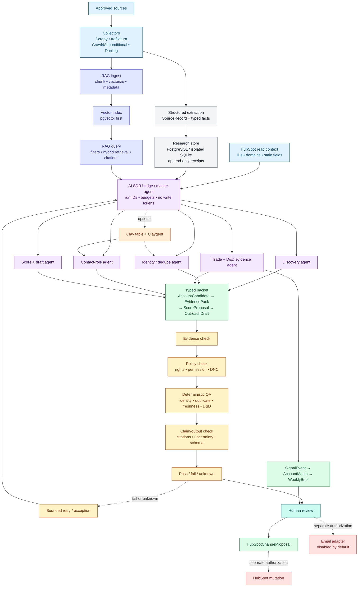

# SheperD AI SDR Operating Blueprint — Ric

> [!abstract] The decision
> Keep the system simple: **approved data → structured research + RAG context → bounded AI workers → audit → human review → Clay/HubSpot outputs**. Clay enriches and organizes GTM work. HubSpot runs the commercial process. No live CRM write or email send is enabled in this brief.

The full [[AI SDR and Market Intelligence Open-Source Landscape]] remains the technical appendix. This note is the short operating model for Ric.

## 1. The simple operating model

| Layer | Simple job | Output |
|---|---|---|
| Approved sources | Pull public, regulatory, trade, contact, partner, and market signals | `SourceRecord` |
| Research store | Keep structured facts, receipts, decisions, and status | `AccountCandidate`, `EvidencePack` |
| RAG context | Make approved company, owner, news, and use-case context searchable | `ContextPack` with citations |
| AI SDR bridge | Coordinate discovery, enrichment, scoring, and drafting | Prioritized account packet |
| Clay (optional) | Enrich, segment, and improve account findability | Reviewed enrichment proposal |
| HubSpot | Track approved accounts, contacts, pipeline, clients, partners, and recovery | CRM proposal or approved record |

The system should produce one useful thing: **a reviewed account packet that tells Mikey who the company is, why it may matter, what evidence supports that view, and what to do next.**

## 2. End-to-end flow — Ric view

```mermaid
flowchart LR
    FEEDS["Internet + approved feeds\npublic • regulatory • trade • contact"] --> STORE["Research store\nstructured facts + receipts"]
    STORE --> RAG["RAG context\ncompany • owners • news • use cases"]
    STORE --> MASTER["AI SDR bridge / master agent\ncoordinates bounded work"]
    RAG --> MASTER
    MASTER --> WORKERS["Sub-agents\ndiscover • enrich • score • draft"]
    WORKERS -. optional enrichment .-> CLAY["Clay\nGTM table + Claygent"]
    CLAY --> WORKERS
    WORKERS --> AUDIT["Audit + gates\nidentity • rights • D&D • DNC • freshness"]
    AUDIT --> REVIEW["Human review\naccept • correct • reject"]
    REVIEW --> OUTPUT["Outputs\naccount list • draft • weekly brief"]
    REVIEW --> PROP["HubSpotChangeProposal\npreview + diff"]
    PROP -. separate authorization .-> HSMUT["Future HubSpot write"]
    OUTPUT -. separate authorization .-> SEND["Future email / follow-up"]

    classDef source fill:#E0F2FE,stroke:#0369A1,color:#0C4A6E
    classDef store fill:#F3F4F6,stroke:#4B5563,color:#111827
    classDef rag fill:#E0E7FF,stroke:#4338CA,color:#312E81
    classDef agent fill:#F3E8FF,stroke:#7E22CE,color:#3B0764
    classDef commercial fill:#FFEDD5,stroke:#C2410C,color:#7C2D12
    classDef audit fill:#FEF3C7,stroke:#B45309,color:#78350F
    classDef human fill:#CCFBF1,stroke:#0F766E,color:#134E4A
    classDef output fill:#DCFCE7,stroke:#15803D,color:#14532D
    classDef protected fill:#FEE2E2,stroke:#B91C1C,color:#7F1D1D
    class FEEDS source
    class STORE store
    class RAG rag
    class MASTER,WORKERS agent
    class CLAY commercial
    class AUDIT audit
    class REVIEW human
    class OUTPUT,PROP output
    class HSMUT,SEND protected
```



Color key: blue = inputs; grey = structured state; indigo = RAG; purple = agents; orange = Clay; amber = controls; teal = human review; green = outputs; red = protected action.

## 3. Four operating pillars

| Pillar | What the system helps with | Human boundary |
|---|---|---|
| HubSpot commercial OS | Account/contact hygiene, lifecycle visibility, next actions, onboarding, recovery, and reporting | Qualification, stage movement, merges, suppression, and CRM mutation |
| AI SDR prospecting | Importer discovery, company/TEU research, role research, D&D signals, scoring, and drafts | Admission, permission, DNC, contact approval, and sending |
| Clay + RAG bridge | Enrichment, company context, news/use-case retrieval, segmentation, and outreach readiness | Provider rights, cost, retention, evidence quality, and downstream action |
| Client/partner operations | Referral attribution, onboarding, invoice/document tracking, pilots, recovery, and partner reporting | Data acceptance, partner rating, recovery value, client decisions, and D3 handling |

Market intelligence is a shared branch: `SignalEvent → AccountMatch → WeeklyBrief`.

## 4. Deep implementation view



### Bounded workers

| Worker | Returns | Rule |
|---|---|---|
| Discovery | Candidate companies | Approved sources only |
| Identity/dedupe | Canonical company and duplicate result | Uncertain identity stops |
| Trade/D&D evidence | Volume evidence and D&D state | Volume never proves loss |
| Contact-role | Role context with source, permission, and DNC | No guessed contacts |
| RAG query | `ContextPack` with cited context | Retrieval cannot rewrite facts |
| Score/draft | `ScoreProposal`, `OutreachDraft` | Uses approved evidence only |
| CRM adapter | `HubSpotChangeProposal` | No write token or stage authority |

LLMs explain and draft. Deterministic code handles identity, deduplication, rights, permission, DNC, freshness, and hard gates.

## 5. RAG context — simple design

RAG is a context service for the agents, not a second CRM.

| Step | What happens |
|---|---|
| Ingest | Approved text about companies, owners/backgrounds, news, use cases, and market signals is chunked, hashed, embedded, and indexed. |
| Metadata | Every chunk keeps source ID, account scope, document type, dates, rights, permission, freshness, hash, and embedding version. |
| Query | A typed `RAGQuery` includes account, intent, allowed data class, freshness window, and result budget. |
| Return | A `ContextPack` returns snippets, citations, relevance, checked date, confidence, and uncertainty. |
| Guardrail | Structured extraction remains authoritative. Unknown, stale, contradictory, restricted, or D3 context does not pass. |

Use PostgreSQL + [pgvector](https://github.com/pgvector/pgvector) first. Consider Qdrant only if measured scale or filtering needs justify it. Keep raw receipts in the research store; keep only permitted, traceable context in the index.

## 6. Small tool stack

| Need | Use | Position |
|---|---|---|
| Collection | [Scrapy](https://github.com/scrapy/scrapy), [trafilatura](https://github.com/adbar/trafilatura), [Docling](https://github.com/docling-project/docling) | Default local collectors and parsers |
| Browser fallback | [Crawl4AI](https://github.com/unclecode/crawl4ai) | Only for allowlisted pages when static collection fails |
| Enrichment/GTM | Clay + [Claygent Builder](https://university.clay.com/docs/claygent-builder) + [HubSpot integration](https://university.clay.com/docs/hubspot-integration-overview) | Optional hosted/commercial workbench; staged output |
| RAG | PostgreSQL + pgvector | First vectorization/queryization path |
| Typed agents | [PydanticAI](https://github.com/pydantic/pydantic-ai) patterns | Structured outputs; no unrestricted tools |
| Local drafting | [Ollama](https://github.com/ollama/ollama) | Optional low-risk explanation/draft model |
| CRM | [Official HubSpot SDKs](https://github.com/HubSpot) | Read/proposal adapter first |
| Reference patterns | [OpenOutreach](https://github.com/eracle/OpenOutreach), [YALC](https://github.com/Othmane-Khadri/YALC-the-GTM-operating-system), [SalesGPT](https://github.com/filip-michalsky/SalesGPT), [OneShot GTM](https://github.com/oneshot-agent/oneshot-gtm) | Borrow ideas; deploy no end-to-end runtime unchanged |

Do not add a generic agent platform, alternate CRM, second vector database, or autonomous sending tool until a measured bottleneck justifies it.

## 7. D&D and safety gates

| State | Meaning | Use |
|---|---|---|
| `observed_loss` | Approved evidence directly documents a cost or recovery issue | Human-reviewed problem hypothesis |
| `exposure_signal` | Dated evidence suggests risk or logistics pain | Cautious research question only |
| `unknown` | Missing, stale, conflicting, or rights-uncertain evidence | Blocks D&D qualification and outreach |

```text
identity + source_rights + contact_identity = pass
permission = allowed; dnc = clear; freshness = pass
dd_state ∈ {observed_loss, exposure_signal}
```

TEU, company size, and importer status prioritize research; they never prove D&D loss. No guessed email, LinkedIn evasion, autonomous follow-up, raw D3 indexing, or unsupported “you lost money” claim.

## 8. Dashboards

Dashboards are a separate management layer. They show decisions, not just activity.

| Dashboard | What it answers | Key measures |
|---|---|---|
| Pipeline | Where are opportunities stuck? | Lifecycle counts, stage aging, next-action coverage, stale opportunities |
| AI SDR/RAG quality | Is research producing usable context? | Evidence-complete rate, role validity, D&D-signal rate, citation coverage, stale/contradictory retrievals, approval rate, cost per packet |
| Outreach readiness | Which accounts are safe to contact? | Identity, permission/DNC, freshness, draft edits, approved cohort response/meetings |
| Client/recovery | Is accepted work moving? | Onboarding completeness, document aging, submission acceptance, validation SLA, recovery requested/realized, cash/credit/reversal |
| Partner/channel | Which partners create quality opportunities? | Referrals, acceptance, qualified meetings, submissions, attribution, SLA, partner quality |
| Management control | What needs a decision this week? | Pipeline by segment/channel/owner, capacity, blocked gates, cost, exceptions, incidents |

## 9. Client and partner operating infrastructure

| Need | Simple system output |
|---|---|
| Client onboarding | Checklist, owner, status, missing item, due date, and SLA alert |
| Document/invoice collection | Request, secure receipt metadata, completeness state, reviewer, and next action |
| Partner → importer attribution | Partner ID, referred account/opportunity, permission, acceptance, and attribution status |
| Partner opportunity registration | Registration date, owner, account status, conflict check, and next step |
| Pilot tracking | Pilot start, scope, evidence status, blockers, decision, and handoff |
| Recovery and money collected | Submission, validation, recovery requested, recovery realized, cash/credit/reversal, and reconciliation state |
| Reporting | Weekly internal pipeline view, partner scorecard, client-safe status view, and management decisions |

AI can prepare checklists, reminders, attribution proposals, and report drafts. Humans accept data, rate partners, approve stage movement, decide recovery value, and handle D3.

## 10. Observations

1. **Start with Clay and HubSpot.** Clay helps us find companies and learn more about them. HubSpot keeps approved companies, people, conversations, pilots, clients, partners, and recoveries organized. The AI SDR bridge connects the two and prepares the next step for Mikey. We do not need to build a complete sales platform ourselves.
2. **Add a searchable news library later.** Once the basic flow works, add RAG—a searchable library of company information, news, port and carrier changes, economic updates, and approved use cases. AI helpers can ask this library what changed, which clients or prospects may be affected, and why. Every answer should show its source.
3. **Keep our custom work small.** Use Clay, HubSpot, and a few focused tools for the standard work. Build only the small connector that checks information, avoids duplicates, protects permissions, and sends a reviewed recommendation to HubSpot. People still make the important decisions.

## Related notes

- [[AI SDR and Market Intelligence Open-Source Landscape]] — full repository catalog, audits, provider gaps, and sources.
- [[03_GTM/SheperD GTM Validation and Optimization - Control Note]] — commercial, CRM, partner, and activation gates.
- [[04_Operations/CRM Data Model]] — objects, provenance, permission, DNC, and events.
- [[04_Operations/Operating Cadence and KPI Dictionary]] — KPI definitions and denominator rules.
- [[03_GTM/Partner Strategy]] — referral attribution and partner quality.
- [[03_GTM/Customer Journey and Funnel]] — stages, submissions, and outcomes.
