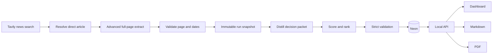

# SheperD Research Pipeline Status and Next Steps

> [!failure] Current result
> The reader-first system is implemented and locally tested, but a fresh accepted research run is blocked. Tavily key 3 returned `plan_usage_limit` again on August 29, 2026. No new canary or weekly run may start until that quota gate passes.

This note explains what the system does, what has been repaired, what is proven, what remains unproven, and the exact sequence needed to finish. It supplements the older [[SheperD Technical and Operations Report]], which describes an earlier migration-0015 database snapshot.

## Goal

Make the SheperD reader-first research pipeline pass end to end with current evidence:

1. Run a fresh strict three-source canary.
2. Run a strict weekly draft targeting 30 sources only after the canary passes.
3. Require at least 10 unique eligible dated sources with the required region and lane coverage.
4. Require one complete distillation and event for every extracted source.
5. Verify the same report through Neon, local API, dashboard, Markdown, and PDF.
6. Keep the report as a draft. Do not deploy, approve, export, upload, push, or send Slack.

## Plain-language system flow

The system searches for current news, resolves each result to a direct article, extracts the full page, validates the page type and dates, and then creates a decision-focused summary. Neon stores the immutable evidence snapshot. The API, dashboard, Markdown, and PDF all read the same canonical report.

## What has been implemented

### 1. Safe execution controls

- `RUN_MODE` defaults to `read-only`.
- `run`, `e2e`, and `repair` require `RUN_MODE=autonomous-draft`.
- Live commands require an explicit `--run-id` and UTC `--as-of`.
- New requests record `context_version` and `research_timezone`.
- Review and export remain separate human-only commands.

### 2. Direct-article acquisition

- Windowed Tavily Search uses `topic=news` so Search can provide `published_date`.
- Advanced Extract retrieves full article content.
- Archive, index, category, landing, feed, RSS, Atom, and XML URLs cannot count as final weekly articles.
- A navigation result can use one bounded same-domain Map step with depth 1 and at most 10 links.
- Raw article bodies stay in memory and are not persisted.

### 3. Date integrity

- The run snapshot stores publication date, retrieval date, date basis, locator, page type, and the direct article URL.
- Date parsing accepts ISO-8601, RFC 2822, and date-only values, then normalizes them to UTC.
- Publication date basis is explicit: `matched`, `page`, `search`, `conflict`, or `unknown`.
- `retrieved_at` never substitutes for a missing publication date.
- Impossible, future, missing, or conflicting dates cannot count as current weekly news.
- Weekly eligibility uses the half-open interval `[covered_from, covered_until)`.
- Undated or conflicting sources remain visible as background evidence.

### 4. Source mapping and distillation

Every complete direct article must produce:

- headline and publisher;
- publication and optional event date;
- exactly three key points;
- what changed;
- why it matters to SheperD;
- a source-bound recommended action;
- supported risk and opportunity statements;
- limitations;
- cited claims and evidence locators;
- one complete signal event.

The deterministic priority score totals 100 points:

| Component | Maximum |
|---|---:|
| SheperD relevance | 30 |
| Operational impact | 25 |
| Actionability | 20 |
| Recency | 15 |
| Source authority | 10 |

The score and rationale live inside the existing insight packet. Ranking does not replace evidence validation.

### 5. Database lineage and repair

- Migration `0016_repair_lineage_event_contract` is applied to Neon.
- Repairs are append-only and parent-scoped.
- Legacy rows remain unchanged and readable.
- Repair children preserve complete snapshots, hashes, distillations, and claims.
- Only incomplete sources are re-extracted and re-distilled.
- All 14 affected repair parents were resolved under the current contract.
- Last verified unresolved repair parent count: `0`.

### 6. API, dashboard, Markdown, and PDF

- Repair runs are excluded from default report lists but remain directly accessible through lineage detail.
- The API reports current reader-contract quality instead of trusting an older stored PASS.
- The dashboard separates current articles from background evidence.
- It shows incomplete, failed, blocked, undated, and unavailable states honestly.
- Mobile page overflow was removed while evidence tables keep their own horizontal scroller.
- Markdown and PDF use the same canonical source links and report hash.
- The reader PDF targets 5 to 8 pages with a first-page decision summary, ranked article cards, watchlist, background items, and a compact source index.
- Hashes, raw receipts, prompts, locators, and internal audit prose stay out of the human PDF.

## What has been verified

### Verified on August 28, 2026

| Area | Result | Evidence |
|---|---|---|
| Neon migration | PASS | `0016_repair_lineage_event_contract` |
| Repair history | PASS | 14 of 14 parents resolved; unresolved count 0 |
| Backend gates | PASS | Ruff, strict mypy, 297 pytest tests, `uv lock --check` |
| Frontend gates | PASS | lint, typecheck, 48 tests, Node 24 production build |
| Local API | PASS | health, audit, lists, detail, Markdown, PDF metadata |
| Dashboard | PASS | desktop, responsive, sources, events, background, lineage, unavailable PDF state |
| Local PDF renderer | PASS | five pages, selectable text, link parity, no application chrome |
| Deployed dashboard | AVAILABLE BUT STALE | HTTP 200 with `Research API unavailable` |
| Deployed API | BLOCKED | HTTP 503 `schema_migration_stale`; deployed code expects `0013`, Neon has `0016` |

### Verified on August 29, 2026

| Area | Result | Evidence |
|---|---|---|
| Git branch | PASS | `codex/production-api-query-fix` |
| Dirty work preservation | PASS | existing edits remain intact |
| Diff whitespace | PASS | `git diff --check` returned no errors |
| Tavily key 3 | BLOCKED | key-only Search returned `plan_usage_limit` |

## Important canary distinction

An earlier three-source run stored a PASS. The current reader contract rejects one source because it is a comments feed rather than a direct article. The report now shows two complete current articles and one incomplete background source.

That older result proves the presentation and compatibility paths work. It does not satisfy the required fresh reader-first canary. A new canary must pass after Tavily quota is restored.

## What remains blocked

| Blocker | Meaning | Required change |
|---|---|---|
| `plan_usage_limit` | Tavily will not run Search for key 3 | Add quota or replace key 3 |
| Fresh canary missing | No accepted reader-first live sample exists | Run strict three-source canary after quota passes |
| Strict weekly missing | No accepted 30-source current weekly draft exists | Run only after canary PASS |
| `schema_migration_stale` | Deployed API code expects migration `0013` | Separately authorize and deploy current API code |
| `review_required` | No human approved the draft | Human reviews after all technical gates pass |
| `pdf_delivery_not_configured` | Private signed PDF delivery is absent | Configure Blob and signing secrets in a separate release task |

> [!warning] Production status
> Production remains blocked even if the research draft passes. Human review, deployed schema parity, and private PDF delivery are separate gates.

## Exact next steps

### Step 1: restore Tavily quota

The only action needed from the user now:

1. Open the Tavily account for key 3.
2. Confirm the account has usable Search and Extract credits.
3. If it does not, add quota or create a key from an account with quota.
4. Put the key in the repository-root `.env.local` as `TAVILY_API_KEY_3`.
5. Do not paste the key into chat.
6. Reply `key3 replaced`.

Stop if a one-result key-only Search still returns `plan_usage_limit`, `authentication`, `payg_limit`, timeout, or provider failure.

### Step 2: run a fresh strict canary

After the key check passes:

1. Capture one UTC `as_of` timestamp.
2. Create a unique canary run ID.
3. Run with `RUN_MODE=autonomous-draft`, explicit `--run-id`, explicit `--as-of`, `--profile canary`, and `--strict`.
4. Require three direct extracted articles, three complete distillations, three complete events, three unique hashes, complete citations and locators, valid dates, and a PASS result.
5. Stop immediately on any provider, source-access, credential, migration, or validation failure.

### Step 3: run the strict weekly draft

Only after canary PASS:

1. Reuse the same `as_of`.
2. Create a unique weekly run ID.
3. Run a strict weekly draft targeting 30 sources.
4. Require at least 10 unique eligible dated sources.
5. Require all configured region and lane gates.
6. Require one complete distillation and event per extracted source.
7. Require complete report sections, 100% citations and locators, unique hashes, and no future dates.
8. Keep the run in draft review state.

### Step 4: verify one canonical report end to end

For the successful weekly run:

- reconcile Neon run, source, distillation, event, claim, validation, and brief counts;
- prove one source-to-distillation relationship per extracted source;
- verify the canonical hash through Neon, local API, Markdown, and PDF metadata;
- verify API health, report list, detail, Markdown, and PDF unavailable metadata;
- test dashboard report, source, event, background, and lineage flows;
- render every PDF page and inspect clipping, overlap, links, page count, and selectable text;
- rerun backend and frontend gates;
- run `git diff --check`;
- recheck deployed services read-only without deploying.

### Step 5: separate production work

These actions require later authorization:

1. Human review and approval.
2. Deploy API and dashboard code that expects migration `0016`.
3. Configure private PDF storage and signed delivery.
4. Verify the deployed API, dashboard, and private PDF link.

No Slack wiring is part of this task.

## Questions for better product understanding

These questions do not block the quota repair or technical canary. They should be answered before production review.

### Reader and decision

1. Who is the primary weekly reader: Michael, Avi, operations, sales, or several roles?
2. What decision should the reader make within 24 hours of reading the report?
3. Should the report prioritize operational disruption, commercial opportunity, regulatory change, or a specific order?
4. What makes an article important enough to appear on page 1?

### Coverage

5. Are the required regions still U.S. regulatory, West Coast, East and Gulf Coast, Mexico, and Europe?
6. Which trade lanes or ports are commercially most important to SheperD?
7. Should Middle East, Canada, and South America remain optional background coverage?
8. Are there publishers or domains that must always be included or excluded?

### Scoring and report format

9. Should the current 30/25/20/15/10 scoring weights remain fixed?
10. What minimum score should qualify for the main report instead of the watchlist?
11. Is the approved 5-to-8-page PDF length correct for weekly use?
12. Should page 1 show exactly three findings, or can it show fewer when evidence is weak?

### Operations and review

13. Which weekday, time, and business timezone define the weekly reporting window?
14. Who is the named human reviewer and backup reviewer?
15. What is the expected review deadline after a draft is ready?
16. Should rejected reports remain visible to all dashboard users or only reviewers?

### Delivery

17. Is the dashboard the primary reading location, with PDF as a downloadable copy?
18. Who may receive private PDF links?
19. What link-expiry period is acceptable?
20. Should Slack eventually send only a short notification and dashboard link, never the full report?

## Immediate answer needed

> [!question]
> Does the Tavily account behind `TAVILY_API_KEY_3` now have active Search and Extract quota? If yes, replace the local value and reply `key3 replaced`.

## Boundaries preserved

- No credential values are stored in this note.
- No raw article bodies or hidden reasoning are persisted.
- No historical evidence is deleted or rewritten.
- No report is approved, exported, uploaded, published, or sent.
- No Git push or Vercel deployment occurs without separate authorization.
- Missing evidence remains blocked or background. It is never converted into a PASS.
