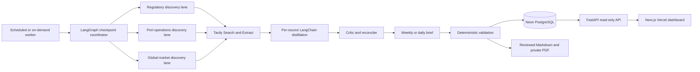

# SheperD Technical and Operations Report

Generated from a read-only Neon snapshot at **2026-08-26T14:23:48.013946Z**. Repository commit `56f73bb01c8aa868eb787caa747d46a8e3231102`; working tree dirty: **true**. This is an operational truth report, not a claim that the research output is production-ready.

## Executive production-readiness status

**Current status: NOT PRODUCTION-READY until the corrected weekly date gate, article/report completeness, human review, and Markdown/PDF delivery gates pass.**

Neon connectivity, provider health, persistence, agent execution, research quality, report readiness, and deployment readiness are separate gates. A healthy database connection proves only infrastructure reachability.

| Dimension | Status | Evidence |
|---|---|---|
| Neon infrastructure | pass | branch `br-weathered-bar-axbzje5c`, migration `0015_pdf_artifacts` |
| Provider diagnostics | pass | redacted checks listed below |
| Data persistence | pass | 15 tracked table counts |
| Agent execution | pass | 1281 steps, 935 tool receipts |
| Research quality | 94.0% | historical completeness must be recomputed |
| Report readiness | 10 succeeded runs; review is separate | validation and sections remain gates |
| Deployment | configured separately | API/UI route checks required |

## Architecture and data flow



Runtime currently uses **OpenAI `ChatOpenAI` with `gpt-5.6-luna`**. It is not currently OpenRouter-powered. Tavily Search and Extract provide discovery and extraction. Neon uses pooled runtime access and direct migration/admin access. Vercel Blob PDF storage is optional infrastructure until its token and artifact flow are configured.

## Infrastructure

- Python/uv service in `research-agents/`.
- LangGraph provides bounded workflow coordination and resumable checkpoints.
- LangChain workers perform discovery, per-source distillation, critique, and synthesis.
- OpenAI is the current LLM provider; model identity is persisted from agent-step metadata.
- Tavily Search/Extract is the source discovery and extraction provider; key slots route requests and do not create a second quota.
- Neon PostgreSQL is canonical. `DATABASE_URL` is pooled runtime access; `DIRECT_DATABASE_URL` is for migrations/admin.
- FastAPI serves read-only data and report endpoints.
- Next.js/Vercel serves the private research dashboard. Database and Blob credentials remain server-side.
- Vercel Blob is intended for approved private PDFs with expiring signed access.

## Agent inventory

1. `regulatory_research_agent` — D&D, FMC, courts, OSRA, and enforcement.
2. `port_operations_research_agent` — U.S., Canada, Mexico, Europe, and port operations.
3. `global_market_research_agent` — South America, Middle East, and global market signals.
4. Bounded per-source distillation workers — one structured packet per successfully extracted source.
5. `critic_agent` — contradictions, unsupported claims, freshness, and citation gaps.
6. `weekly_synthesis_agent` — cited report sections and follow-up questions.
7. LangGraph coordinator — state, budgets, checkpoints, persistence, and validation.

No prompts, raw article bodies, or hidden chain-of-thought are retained. Agent rationale is represented by structured evidence, limitations, verification basis, impact, and next steps.

## Agent metrics

### Steps by agent

| Agent | Steps | Succeeded | Failed | Total latency |
|---|---:|---:|---:|---:|
| critic | 194 | 136 | 57 | 4163094 ms |
| discovery | 95 | 46 | 40 | 6331039 ms |
| discovery:mexico | 188 | 66 | 117 | 4854029 ms |
| discovery:regulatory | 180 | 76 | 99 | 3525714 ms |
| discovery:us-ports | 185 | 60 | 120 | 3435794 ms |
| distillation | 304 | 209 | 88 | 8515143 ms |
| extraction | 57 | 57 | 0 | 423027 ms |
| synthesis | 47 | 27 | 16 | 882700 ms |
| validation | 31 | 14 | 17 | 69869 ms |


### Tool receipts

| Tool | Status | Calls | Results | Total latency |
|---|---|---:|---:|---:|
| tavily_extract | failed | 4 | 0 | 6534 ms |
| tavily_extract | succeeded | 247 | 1046 | 4626405 ms |
| tavily_search | failed | 49 | 0 | 92872 ms |
| tavily_search | succeeded | 635 | 1412 | 6522742 ms |


### Model usage

| Model ID | Steps | Input tokens | Output tokens |
|---|---:|---:|---:|
| dots-studio/dots-3-note-preview:free | 20 | 8172 | 9696 |
| google/gemma-4-26b-a4b-it:free | 178 | 85191 | 25540 |
| google/gemma-4-31b-it:free | 33 | 0 | 0 |
| gpt-5-mini | 2 | 0 | 0 |
| gpt-5-mini-2025-08-07 | 2 | 2614 | 2308 |
| gpt-5.4-nano | 32 | 0 | 0 |
| gpt-5.4-nano-2026-03-17 | 66 | 142120 | 75614 |
| gpt-5.6-luna | 473 | 1439866 | 853109 |
| liquid/lfm-2.5-2.6b:free | 5 | 0 | 0 |
| not recorded | 256 | 0 | 0 |
| nvidia/nemotron-3-super-120b-a12b:free | 112 | 46844 | 17853 |
| nvidia/nemotron-3-ultra-550b-a55b:free | 15 | 0 | 0 |
| nvidia/nemotron-3.5-lightning:free | 13 | 0 | 0 |
| nvidia/nemotron-nano-9b-v2:free | 13 | 9753 | 6655 |
| openai/gpt-oss-20b:free | 12 | 1013 | 304 |
| openrouter/free | 5 | 0 | 0 |
| z-ai/glm-5.2:free | 44 | 0 | 0 |


Prompt versions are stored as identifiers only. Current workflow identifiers include `discovery-v3-multilingual`, `distill-v6-insight`, `critic-v5-evidence`, and `weekly-brief-v6-decision`; prompt text is intentionally excluded.

## Neon table catalog

| Table | Grain and purpose | Relationships | Retention | Live rows |
|---|---|---|---|---:|
| `research_runs` | one immutable execution and readiness state | root | append-only run record | 101 |
| `agent_steps` | agent-stage status, model, latency, tokens, errors | research_runs | append-only audit | 1281 |
| `agent_tool_calls` | Tavily Search/Extract receipts | agent_steps | append-only audit | 935 |
| `run_sources` | run-scoped source participation and period state | research_runs + sources | append-only participation | 1180 |
| `sources` | canonical source metadata | canonical_url | upsert metadata; facts preserved | 127 |
| `source_snapshots` | retrieval hashes and collection timestamps | research_runs + sources | append-only snapshots | 372 |
| `article_distillations` | structured article summaries and insights | research_runs + sources | one run-scoped packet | 955 |
| `claims` | cited factual claims and evidence state | research_runs | corrections supersede | 6670 |
| `signal_events` | structured industry signals | research_runs | append-only events | 2164 |
| `weekly_briefs` | synthesized report sections | research_runs | draft until review | 27 |
| `validation_checks` | durable validation-gate result | research_runs | latest run gate | 48 |
| `review_decisions` | human approval or rejection | research_runs | append-only decisions | 0 |
| `checkpoints` | LangGraph resumable state | thread/run | managed by checkpoint saver | 3912 |
| `checkpoint_blobs` | serialized checkpoint values | checkpoint | managed by checkpoint saver | 1721 |
| `checkpoint_writes` | checkpoint write history | checkpoint | managed by checkpoint saver | 4978 |


Facts are append-oriented. Corrections create superseding claims or new run-scoped records. Failed and archived runs retain their evidence. GIN indexes support full-text search where configured; B-tree indexes support run status, dates, evidence, lanes, models, and period state. Orphan checks: `{"claims_without_run": 0, "distillations_without_source": 0, "run_sources_without_source": 0}`.

Live row counts are the current growth baseline; historical growth requires periodic snapshots and is not inferred here. API and UI count reconciliation remains a separate deployment gate—the database count alone is not presented as browser parity.

## API and UI data flow

The API reads Neon summaries and detail payloads. The UI never receives database credentials and must show explicit unavailable, empty, partial, failed, undated, background, and incomplete states. Weekly list responses should use database-side aggregates; detail pages hydrate source evidence and audit records.

Primary routes: `/api/health`, `/api/reports/weekly`, `/api/reports/weekly/{run_id}`, `/api/reports/weekly/{run_id}/markdown`, `/api/reports/weekly/{run_id}/pdf`, `/api/reports/monthly`, `/api/sources/explorer`, `/api/runs/{run_id}/audit`. The PDF route is available only after a private artifact and signing configuration exist.

## Validation gates and blockers

Historical run status: `{"active": 4, "archived": 97, "failed": 69, "partial": 21, "succeeded": 10}`. Historical article quality: `{"article_insight_completeness": 0.940314, "briefs_total": 27, "briefs_with_complete_sections": 16, "distillations_complete": 898, "distillations_incomplete": 57, "distillations_total": 955, "report_section_completeness": 0.592593}`.

Provider and environment diagnostics (redacted):

- environment: pass
- model_policy: pass
- tavily: pass
- openai: pass
- neon_management: not_configured
- database_pooled: pass
- database_direct: pass

Audit blockers:

- period:eligible_weekly_sources: no persisted source has a publication date inside its weekly window
- quality:incomplete_article_insights: 57 historical distillations remain incomplete
- quality:empty_report_section: 11 historical briefs have incomplete sections

The corrected weekly gate counts only sources with `period_status=in_period` and `eligible_for_weekly=true`. Sources without publication dates, or published outside the half-open window, remain visible as background context and do not count as current-week findings. Future-dated sources fail validation.

### Persisted period classification

| Period status | Run-source rows |
|---|---:|
| `undated` | 1180 |


## Cost model

This is an estimate, not an invoice. Confirm the configured model’s current account rate before billing decisions.

| Component | Basis |
|---|---|
| OpenAI | approximately $0.50 / 1M input tokens and $3.00 / 1M output tokens for the captured short-context proxy rate card |
| Tavily Search | 1 credit per basic Search call |
| Tavily Extract | approximately 1 credit per five successful URLs |
| Tavily allowance | 1,000 credits/month; routed key slots do not double the quota |
| Vercel Hobby dashboard | $0 within plan limits |
| Vercel Pro dashboard | approximately $20/month plus usage |
| Vercel Blob | Hobby included limits; beyond them, usage-based storage/operations/transfer |
| Neon | $0 under the currently configured plan; verify plan limits |
| Separate ingestion worker | TBD until a host is selected |

Rate-card references (retrieved 2026-08-26): OpenAI [pricing](https://platform.openai.com/pricing), Tavily [credits](https://docs.tavily.com/documentation/api-credits) and [pricing](https://www.tavily.com/pricing), Vercel [pricing](https://vercel.com/pricing), and Blob [pricing](https://vercel.com/docs/vercel-blob/usage-and-pricing). The configured Luna rate is a proxy and must be confirmed against the account.

Forecast from the latest recorded weekly token volume:

```json
{
  "basis": "latest recorded weekly token volume divided across seven days; excludes Tavily and hosting",
  "daily_llm_proxy_usd": 0.02499,
  "latest_weekly_llm_proxy_usd": 0.174928,
  "monthly_llm_proxy_usd": 0.758021,
  "weekly_llm_proxy_usd": 0.174928
}
```

Observed usage-derived estimate:

```json
{
  "estimated_provider_usd": 10.993024,
  "input_tokens": 1735573,
  "llm_estimated_usd": 3.841024,
  "model": "not recorded",
  "output_tokens": 991079,
  "rate_card": {
    "openai": {
      "basis": "captured short-context proxy; confirm the configured model rate",
      "input_usd_per_million_tokens": 0.5,
      "model": "gpt-5.6-luna",
      "output_usd_per_million_tokens": 3.0,
      "source_url": "https://platform.openai.com/pricing"
    },
    "retrieved_at": "2026-08-26",
    "tavily": {
      "credits_source_url": "https://docs.tavily.com/documentation/api-credits",
      "extract_urls_per_credit": 5,
      "free_credits_per_month": 1000,
      "pricing_source_url": "https://www.tavily.com/pricing",
      "search_credits_per_call": 1,
      "usd_per_credit": 0.008
    },
    "vercel": {
      "blob_pricing_source_url": "https://vercel.com/docs/vercel-blob/usage-and-pricing",
      "pricing_source_url": "https://vercel.com/pricing"
    }
  },
  "tavily": {
    "credits": 894,
    "estimated_usd": 7.152,
    "extract_credits": 210,
    "extracted_urls": 1046,
    "free_allowance_credits": 1000,
    "search_calls": 684,
    "search_credits": 684
  }
}
```

Historical proxy from the captured database baseline was about $3.23 for 1,418,168 input and 840,180 output tokens. The latest recorded weekly proxy was about $0.18 for 77,749 input and 45,351 output tokens. These values are rate-card estimates, not provider invoices.

## Weekly date-window policy

`as_of` is normalized to UTC. Business boundaries are calculated in `RESEARCH_TIMEZONE` and stored in UTC. Weekly eligibility uses the half-open interval `[covered_from, covered_until)`: only a publication date inside the interval counts as current-week evidence. `retrieved_at` records collection time and never silently replaces a missing publication date. Undated and out-of-period material is retained as labeled background context.

## Markdown and PDF delivery

Markdown and PDF are generated from the same structured Neon snapshot. Reports contain article summaries, original/English fields, key points, claims, excerpts/locators, citations, period and freshness statuses, hashes, validation, audit metrics, limitations, and a background appendix. Raw bodies, prompts, credentials, and hidden reasoning are excluded.

PDF generation is worker-side static HTML plus print CSS and headless Chrome/Chromium. The renderer must verify file existence, page count, selectable text, source links, and absence of application chrome. Approved PDFs are private Vercel Blob artifacts accessed with expiring signed URLs; drafts can be previewed as Markdown but are not uploaded.

## Recommended next steps

1. Reconcile the `0014_run_source_periods` backfill and revalidated run statuses on Neon `main`.
2. Run a new weekly collection with at least 10 eligible in-period published sources, targeting 20–30.
3. Require 100% article insight and report-section completeness, citation coverage, and evidence-locator coverage.
4. Configure a worker-side Chrome binary and the three server-side PDF/Blob variables.
5. Human-review the passing brief, export Markdown/PDF, and verify the signed URL.
6. Deploy the API and UI only after Neon/API/UI counts and statuses reconcile.
