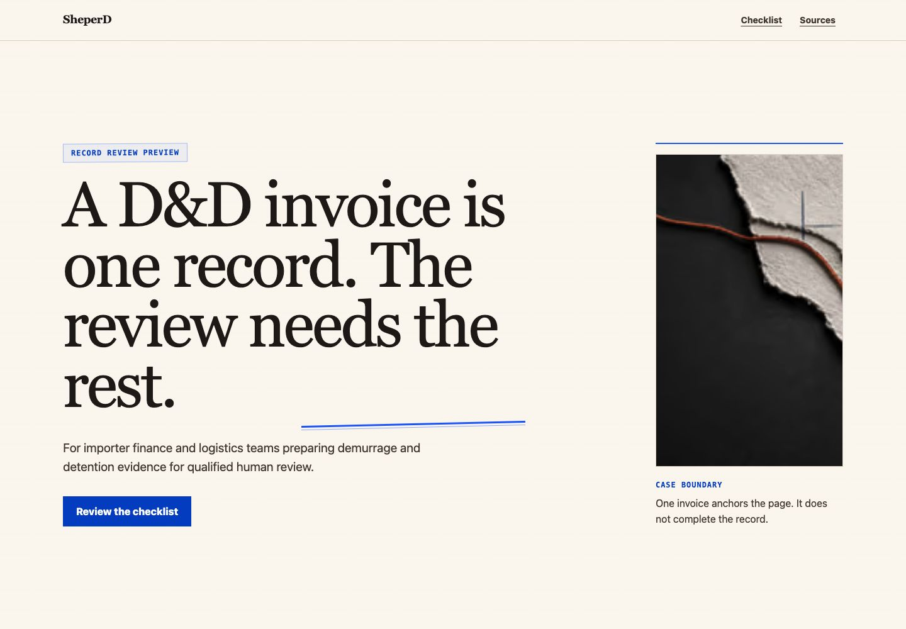
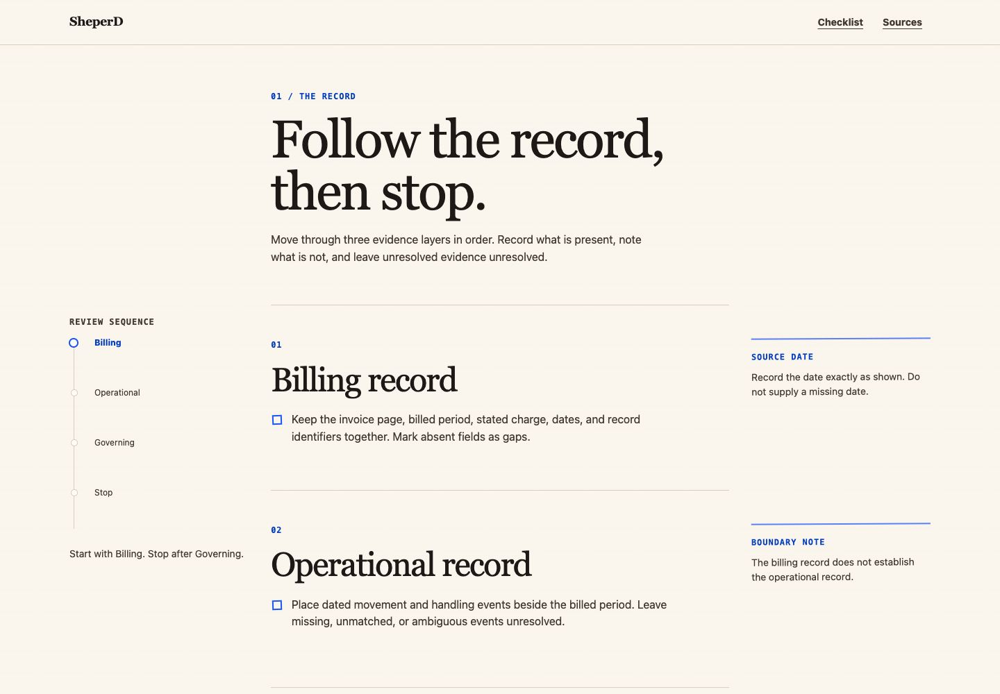
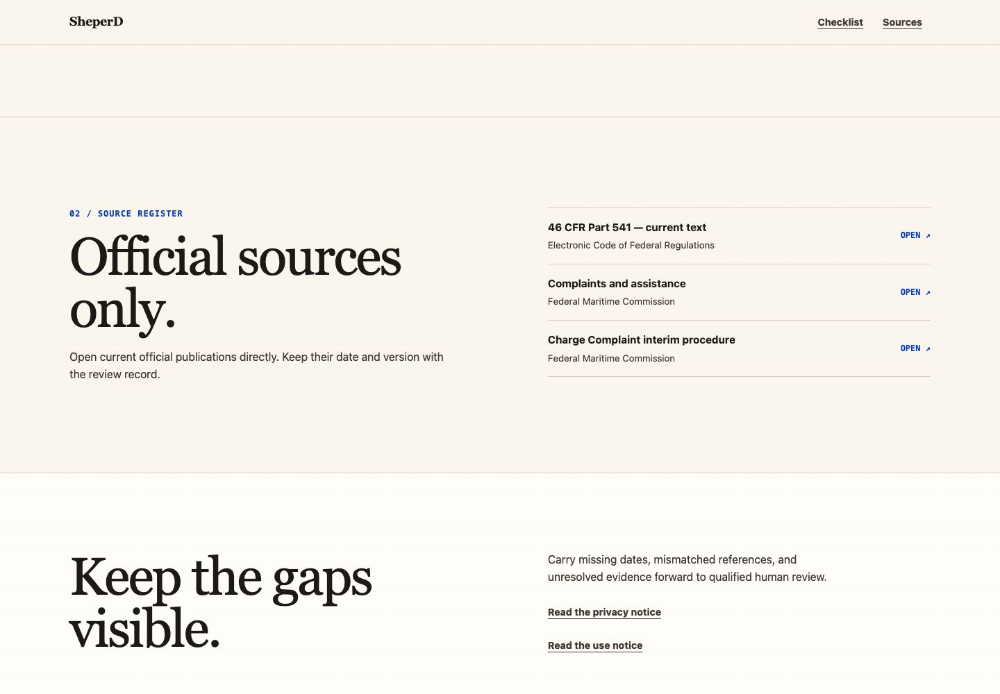

# SheperD Full Design-Depth Audit

Status: read-only audit of the running local Preview
Date: 2026-07-15
Scope: home entry, evidence sequence, source/closing path, notice-route structure, brand surfaces, imagery, motion, accessibility risk, and performance implications

Assumption: “better contracts” means better **contrast**. If literal contracts were intended, the existing legal/publication contract remains a separate fail-closed requirement and should not be weakened by the redesign.

## Verdict

The site is structurally trustworthy, readable, accessible, and fast. It is not yet visually rich or niche-specific enough to feel like a premium maritime-finance experience. The dominant warm-paper/Georgia treatment reads as an editorial compliance memo. Blue is an annotation color, not a complete brand system. One abstract image, mostly uniform section backgrounds, a static evidence rail, and missing social-brand assets make the experience feel finished technically but underdeveloped creatively.

No local P0 was found. The main opportunity is a design-system and narrative-depth pass, not another generic polish pass.

## Current score

| Area | Score | Audit finding |
| --- | ---: | --- |
| Trust and evidence safety | 9/10 | Clear boundaries, official sources, no fabricated proof |
| Accessibility foundation | 9/10 | Strong semantics, focus, reduced motion, target sizing, contrast |
| Performance foundation | 10/10 | Lighthouse 100 and no third-party runtime in the current QA baseline |
| Message clarity | 8/10 | Audience and problem are immediate |
| Color system | 6/10 | Cobalt is effective but too sparse; the page remains visually beige |
| Niche/brand fit | 5/10 | Editorial/legal mood is stronger than maritime/logistics/finance identity |
| Imagery | 4/10 | One competent abstract image cannot carry the full brand narrative |
| Section architecture | 6/10 | Good sequence, weak visual cadence and insufficient section variety |
| Motion system | 4/10 | Entry and scroll translation exist, but the evidence rail never progresses |
| Brand/distribution surfaces | 3/10 | Basic SVG favicon; no OG, Twitter card, Apple icon, or manifest |

## Captured flow

### Step 1 — Entry and hero: healthy structure, weak brand depth

Strengths:

- The first screen answers audience, problem, and next action quickly.
- The serif scale is confident and the image crop creates a recognizable editorial composition.
- The CTA is honest: it moves to existing page content and does not imply intake or service capability.
- Contrast and whitespace make the page easy to scan.

Risks:

- Warm paper occupies nearly the entire field; cobalt appears only as small marks and a button. The requested blue identity is absent at system level.
- Georgia plus torn paper strongly signals publishing, law, or archival research. Maritime/logistics context is present only in copy.
- The hero has substantial dead air above the core message at desktop height.
- The image is texturally good but semantically generic. It does not establish containers, routes, billing, timestamps, or record alignment.
- The wordmark is plain text and visually interchangeable with the body’s serif language.

### Step 2 — Evidence sequence: healthy information architecture, weak state/motion

Strengths:

- Billing, Operational, Governing, and Stop form a clear information hierarchy.
- The left rail, main record column, and right margin notes create a useful three-part desktop rhythm.
- The content stays evidence-safe and avoids fake dashboards or product claims.

Risks:

- The rail looks interactive/current-state-aware, but `aria-current` is permanently set to Billing and no code updates the step. The visual story promises progression without delivering it.
- `.marker-rail[data-step="3"]` exists in CSS but the component never sets `data-step`.
- Scroll motion only translates rows. It does not connect the rail, annotations, image, and stop boundary into one narrative.
- Every record row uses the same typographic composition. The sequence is clear but becomes visually repetitive.
- The blue annotations are thin and secondary; they do not create a memorable evidence-system identity.

### Step 3 — Sources and close: trustworthy, but visually and conversion-wise thin

Strengths:

- Official-source links are clear and easy to verify.
- The closing retains the evidence-gap rule and avoids an unsupported commercial promise.
- Link rows are simple, legible, and accessible.

Risks:

- Sources and closing use nearly the same light field as the rest of the page. The end of the journey lacks a strong tonal shift.
- The source list looks administrative rather than authoritative or premium.
- “Keep the gaps visible” is a good safety close but not a strong next-step close.
- The conversion path is necessarily limited by missing approved contact/intake ownership. A visual redesign cannot safely invent that destination.

### Step 4 — Privacy and use notices: structurally healthy; visual capture blocked

General health: healthy structure, intentionally sparse.

- DOM inspection confirmed one H1, logical H2 sections, skip link, notice navigation, and footer on both routes.
- The copy correctly distinguishes Preview behavior from production policy or service terms.
- The pages repeat the same cream/serif/rule composition and would benefit from the revised blue system.
- The in-app browser’s screenshot compositor duplicated tiles after responsive viewport switching. Those notice screenshots were rejected and deleted; no visual conclusion relies on them.

## Highest-impact changes

### 1. Promote blue from accent to atmosphere

Use a maritime evidence palette with solid fields rather than generic blue gradients or “AI glow.” Recommended semantic tokens:

| Token | Value | Role |
| --- | --- | --- |
| `navy-950` | `#061A33` | dark hero/source/stop fields |
| `navy-800` | `#0B2E59` | elevated dark surfaces |
| `blue-600` | `#155EEF` | CTA, focus, active evidence state |
| `azure-400` | `#2E90FA` | secondary annotation |
| `cyan-300` | `#66D4FF` | route/time/source highlights on navy |
| `ice-100` | `#EAF2FF` | light blue section surface |
| `canvas` | `#F7FAFF` | primary light field |
| `ink` | `#081426` | primary light-surface text |
| `muted` | `#44546A` | secondary light-surface text |
| `signal` | `#FF6B35` | sparse safety/exception cue only |

Suggested distribution: 60% canvas/ice, 25% navy, 10% cobalt/azure, 5% cyan/signal. Verified contrast pairings include ink/canvas 17.63:1, muted/canvas 7.37:1, cobalt/canvas 5.17:1, white/cobalt 5.41:1, cyan/navy 10.33:1, signal/navy 6.16:1, and white/navy 17.45:1.

Do not reduce the current contrast quality merely to gain a stronger palette.

### 2. Replace one-image decoration with a four-asset system

Use original generated imagery, not stock customer scenes or fabricated case evidence:

1. **Hero:** blue-hour macro of container geometry, route markings, and layered record materials; no logos, people, readable documents, or implied result.
2. **Three-record study:** a wide triptych showing distinct material languages for billing, operational timing, and governing sources.
3. **Stop boundary:** a dark navy still life with an interrupted route/thread and a visible unresolved gap.
4. **Social image:** a purpose-built 1200×630 Open Graph composition using the hero art, SheperD label, approved headline, and Preview boundary.

Below-fold images should lazy-load, ship responsive AVIF/WebP derivatives, and preserve the current total-image transfer ceiling.

### 3. Rebuild the section rhythm without inventing claims

Recommended evidence-safe sequence:

1. **Hero — The invoice is only the surface.** Audience, thesis, CTA, original maritime image.
2. **Problem frame — What one invoice cannot show.** A split editorial composition contrasting the invoice anchor with missing operational/governing context.
3. **Three records — One review sequence.** Three horizontal visual bands, not three SaaS cards.
4. **Evidence walkthrough.** Keep the current record architecture, but make the rail genuinely progress.
5. **Stop boundary.** Full-width navy section explaining where unresolved evidence moves to qualified review.
6. **Official-source register.** Dark authoritative register with dates, issuer, and clear outbound actions.
7. **Closing action.** Keep an honest in-page action until an approved contact/intake destination exists.

This gives every section a distinct job while preserving the claim ledger and no-collection boundary.

### 4. Use Motion selectively, not as a blanket rewrite

The current site uses CSS `enter-up`, CSS View Timeline row movement, hover transitions, and a reduced-motion fallback. It has motion-in, but essentially no meaningful motion-out or state progression.

Recommended storyboard:

- **Hero in:** eyebrow, headline lines, support, and CTA enter in a controlled 40–60ms stagger; image reveals through a vertical clip.
- **Hero out:** only the underline, route thread, and image move subtly as the next section enters. Keep readable text visible; do not fade primary content away.
- **Evidence state:** each record becoming visible updates the rail’s active item and cursor. Leaving records reduce emphasis but remain readable.
- **Annotations:** right-margin notes draw in from their rule rather than simply translating upward.
- **Stop boundary:** active rail becomes a square stop marker and the navy field closes the sequence.
- **Sources:** rows reveal progressively; arrows translate a few pixels on hover/focus.
- **Reduced motion:** no transforms, parallax, or stagger; all content and final states render immediately.

If Motion for React is added, isolate it to one client-side narrative component. Use `LazyMotion`, `m`, and `domAnimation`; avoid the full `motion` component, `domMax`, layout animation, drag, and scroll hijacking. The current script transfer is 127,634 bytes, leaving only 22,366 bytes under the 150,000-byte goal. Official Motion guidance estimates the full component near 34 KB but `LazyMotion`/`m` near 4.6 KB initial, with features deferrable.

### 5. Build a real brand-surface package

Current state:

- One `/icon.svg`
- No `og:title`, `og:image`, Twitter card, Apple touch icon, manifest, or mask icon
- `theme-color` remains warm paper

Recommended package:

- Distinct compact mark that survives 16px; avoid the current thin path/line symbol.
- `favicon.ico` with 16px and 32px sizes.
- 32px/48px PNG icons, 180px Apple touch icon, and 192px/512px app icons.
- Monochrome mask icon for pinned tabs.
- 1200×630 Open Graph image plus explicit alt text.
- `og:title`, `og:description`, `og:type`, `og:image`, `twitter:card=summary_large_image`, and matching Twitter title/description/image.
- Blue `theme-color` aligned with the header/hero.

Because the app uses the Pages Router, add explicit `next/head` metadata and static public assets. Do not introduce a canonical production URL until the production origin and publication authority are approved.

## Typography and component schema

- Keep editorial authority, but reduce the “legal journal” feel. Use one self-hosted display serif plus a condensed operational sans or mono for route labels, timestamps, and source metadata.
- Turn the plain text wordmark into a deliberate lockup with a compact icon and stronger spacing rules.
- Expand semantic design tokens: canvas, surface, inverted surface, primary/secondary text, active/inactive evidence, focus, source, gap, stop, and signal.
- Define border weights and corner behavior explicitly. The current mix is mostly square, but this is accidental rather than a documented brand rule.
- Add two image aspect-ratio tokens and two section-density modes so visual rhythm is systematic rather than one-off.

## Accessibility risks and safeguards

Confirmed strengths:

- Semantic landmarks and headings.
- Skip link and visible focus styling.
- 44px-oriented targets.
- Reduced-motion and forced-colors handling.
- Strong current contrast.

Risks to control during redesign:

- Do not express Billing/Operational/Governing state through blue hue alone; retain text and shape changes.
- Announce active progress only if it becomes a real state. Do not use an `aria-live` region for passive scroll.
- Avoid moving text out of view during motion-out sequences.
- Keep source rows and CTA states clear under forced colors.
- Retest 200% zoom, keyboard, no-JavaScript content, and all six responsive baselines after adding a client motion island.

## Optimization contract for the redesign

- Preserve Lighthouse mobile Performance ≥95, Accessibility 100, Best Practices 100, and CLS ≤0.05.
- Keep initial transferred JavaScript under 150,000 bytes.
- Keep total page image transfer under 2 MB, with the hero prioritized and all lower imagery lazy-loaded.
- No third-party fonts, animation runtime, media, analytics, or embeds loaded from external origins.
- No video background or Lottie payload.
- Keep primary content server/static rendered; hydrate only the motion/progress island.
- Run a post-change bundle comparison and six-viewport visual regression before acceptance.

## Recommended implementation order

1. Approve one blue visual direction and an original-image moodboard.
2. Lock semantic color/type/image/motion tokens in `DESIGN.md`.
3. Produce favicon, icon family, and OG image from the selected mark/art direction.
4. Restructure sections using approved existing claims only.
5. Implement the visual system without Motion first.
6. Add one lazy Motion client island for the evidence narrative.
7. Re-run copy safety, accessibility, browser, bundle, visual, and Lighthouse gates.

## Evidence limits

- This is expert heuristic review, not user testing or measured conversion evidence.
- The current Preview intentionally has no real lead-capture destination; conversion quality cannot be judged beyond the in-page CTA.
- Mobile viewport structure was inspected, but current-run mobile screenshots were rejected because the in-app browser compositor duplicated tiles after viewport switching. No mobile visual finding relies on those rejected captures.
- Notice routes were structurally inspected from their live DOM; their post-resize screenshots were rejected for the same compositor issue.
