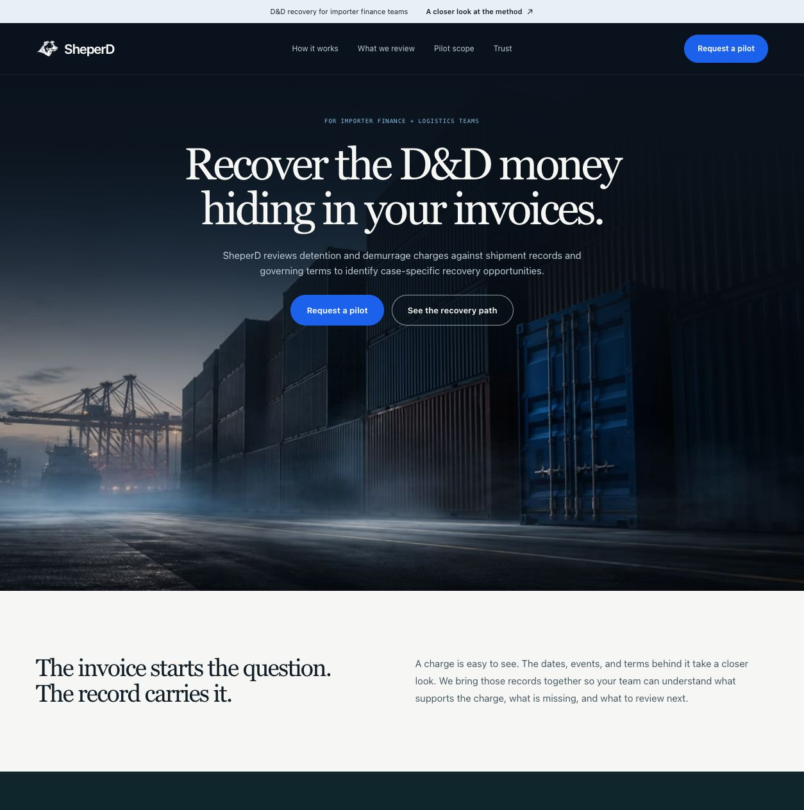
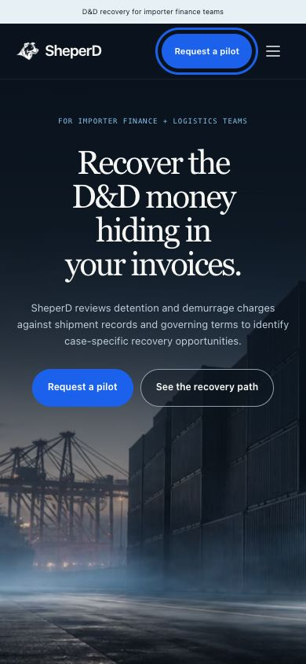
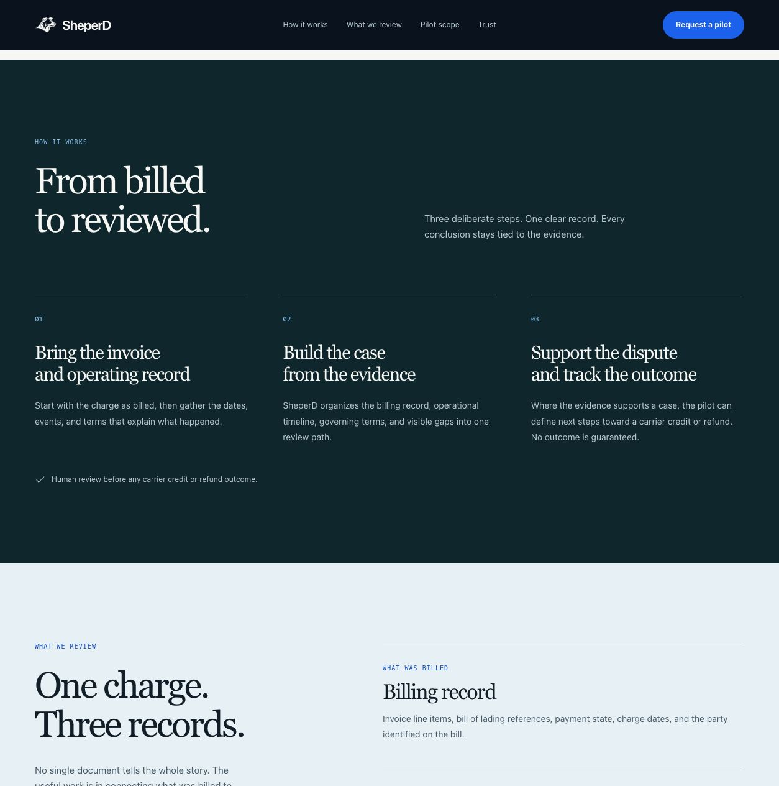
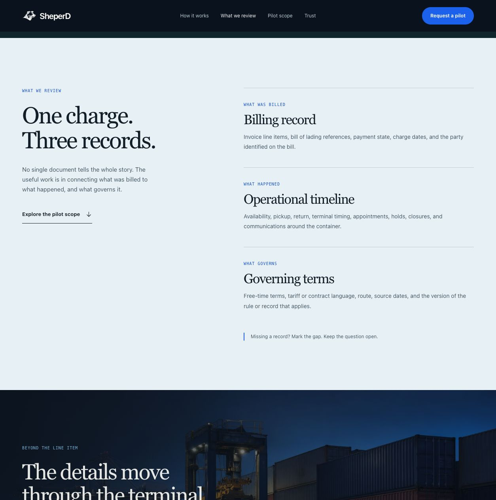
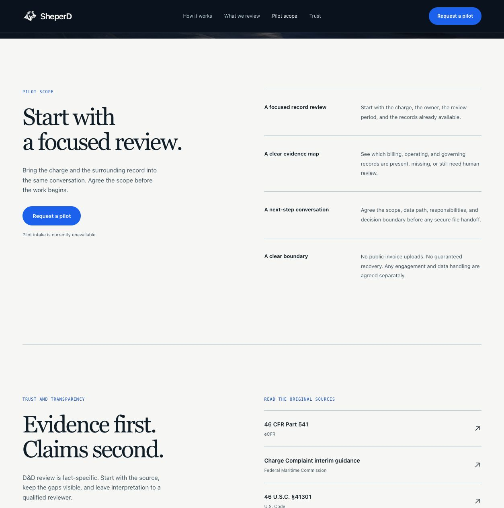
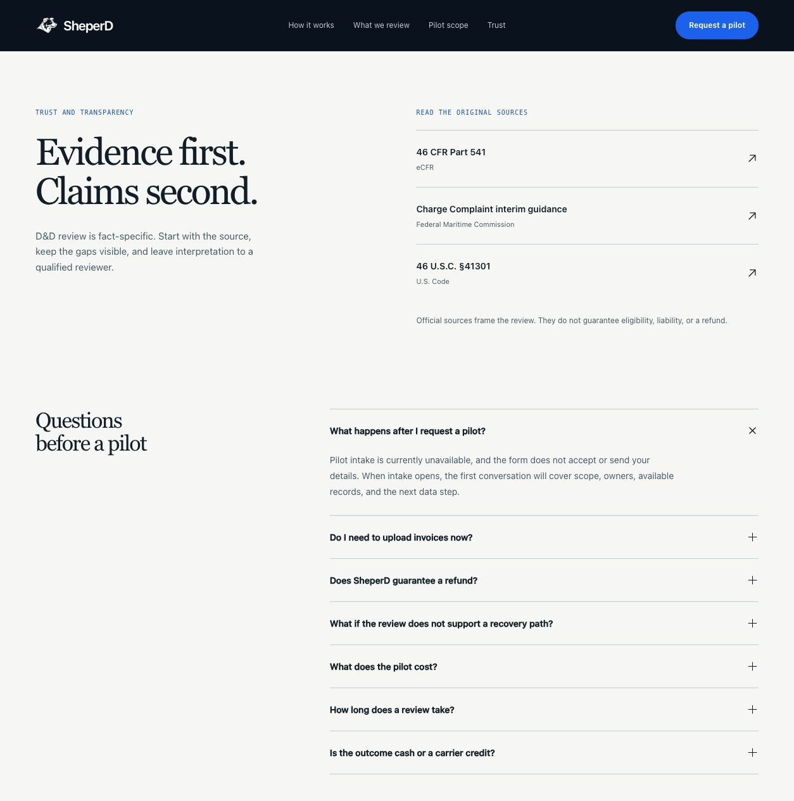
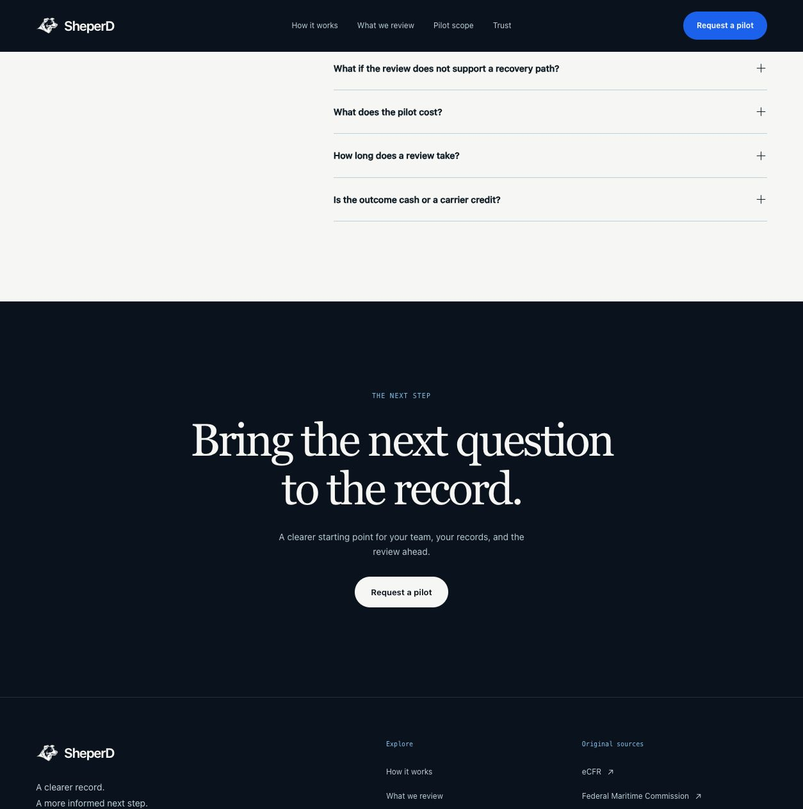
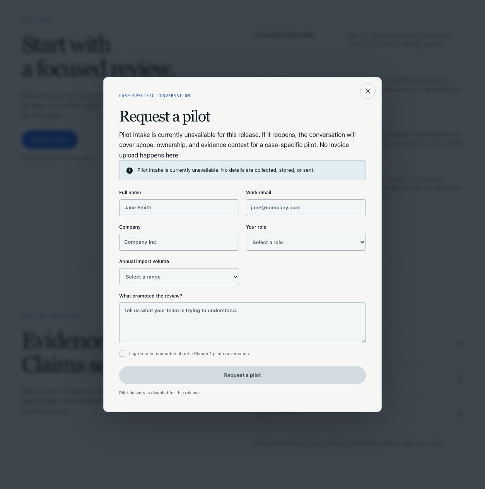
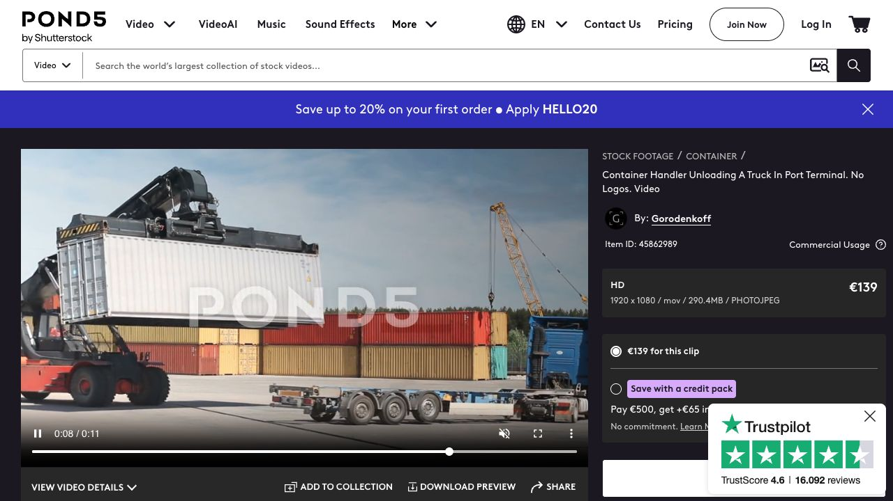
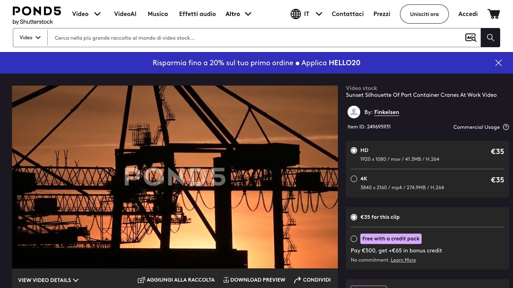

# SheperD: website review and next iteration

**6 September 2026 · Business context, UX, storytelling, motion, and development lessons**

The next improvement should make the service easier to understand. Keep the visual identity we have established, show what a review contains, and give visitors a useful next step while intake is closed. Use one carefully selected operational video to bring the terminal to life.

This document records the website at commit `7d32cab` and proposes the next iteration. The company-copy correction below is implemented in the application; the illustrative example, layout proposals, and replacement footage remain **future work**. The dated screenshots show the original audit, before this copy update.

### Company-copy correction — 6 September 2026

The owner confirmed [sheperd.io](https://sheperd.io/) as the real company website. Its published offer is a managed D&D service for U.S. importers: invoice handling, carrier coordination, disputes, and recovery. The application now uses that context in its hero summary, process, pilot explanation, FAQ, footer, and search/social descriptions. The visual direction and Vercel canonical origin stay as configured.

Published contact details are **avi@sheperd.io** and **+972 53 7252 334**. Native email and phone links give visitors a contact route while this website's intake remains disabled. They do not activate its API or form. Payment, financing, and credit require a separate agreement. The FAQ's short D&D definition follows the [Federal Maritime Commission](https://www.fmc.gov/detention-and-demurrage/).

The company site supplies positioning, not independent evidence of results. This adaptation does not import its recovery percentages, monetary examples, same-day language, blanket invoice-age eligibility, or success-fee promises. Engagement scope, operating capacity, timing, pricing, secure handoff, and customer proof still need case-specific confirmation.

## 1. The context we are designing for

SheperD's published audience is U.S. importers, including finance and logistics teams dealing with detention and demurrage charges. Finance needs to understand the bill; operations holds much of the shipment history. The website's job is to connect those perspectives and explain how the service team supports the work.

The central story is:

**A charge arrives → the invoice is matched to events and terms → gaps become visible → a human reviewer determines the next step.**

The older internal [audience brief](AUDIENCE-AND-JOB.md) treated this as an audience hypothesis. The company website now establishes its published positioning, but does not independently prove customer demand, recovery rates, turnaround, or conversion. These should not become decorative statistics or unsupported promises.

### Which website is which

| Surface | Role and status |
|---|---|
| [sheperd.io](https://sheperd.io/) | Existing company website, confirmed by the owner; first-party source for business copy and contact details. |
| [sheperd-website.vercel.app](https://sheperd-website.vercel.app/) | This repository's public redesign and configured canonical origin; no domain migration is included. |
| `sheperd-website` Vercel project, root `website` | Existing React/Next.js application; production branch `main`. |
| Local development and feature previews | Places to review changes before release; their URLs do not replace the canonical origin. |
| `website/mockups/` | Art-direction references, not deployed interfaces. |
| [shepherd.com](https://www.brannans.com/domain/shepherd-com/) | Earlier mistaken reference, corrected by the owner to `sheperd.io`. The domain-sale listing is unrelated to the copy adaptation. |

At the original audit, Vercel identified production as commit `7d32cab7923decf199b90c1bd7ec5cb8ec87a62a`, deployment `dpl_9e7HPNNBivFqxPdXMxD85FjiJ1Zu`, state `READY`. The review branch starts from that commit. There is no WordPress implementation in this website.

The approved September direction supersedes the old educational-only Preview strategy in several July documents. Use [DEPLOYMENT.md](../DEPLOYMENT.md) and the current application for release behavior. Retain the older documents as history and sources of factual constraints; do not treat their old ban on CTAs as the current product brief. Publication approval does not establish customer outcomes or an operational capability by itself.

## 2. What the current visitor journey shows

These observations describe the original live-site audit at `7d32cab`, before the company-copy update above. Desktop captures use the Codex in-app browser's **1254 × 1264** viewport; the mobile first impression uses **390 × 844**. Screenshots were inspected before inclusion. Findings about comprehension are design judgments, not results from customer testing.

### Step 1 — Arrive at the hero: strong visual identity; incomplete offer clarity

The centered serif headline, animal mark, restrained navigation, full-width terminal, and cobalt action are coherent. The headline and both hero actions fit in the mobile viewport. At 390px, document and body width both measured 390px.

The hero says who the page is for and describes the review. It does not explicitly establish whether SheperD is a managed service, software product, or scoped advisory engagement. The primary button promises a request, although that request cannot currently be made.

The current video played during inspection and paused after navigating offscreen. It animates atmosphere; the containers themselves do not move.

**Next change:** keep the composition. Add a precise service category once confirmed, and use an action that works in the current availability state.

Mobile hero evidence

### Step 2 — Understand the method: readable; too abstract

The process is a real three-item list, with clear desktop columns. The evidence section separates billing, operations, and governing terms into readable rows. Navigation to the process updated the hash and moved focus to the target section.

Several headings restate the same idea: “The record carries it,” “From billed to reviewed,” and “One charge. Three records.” The categories are explained, but visitors never see how a piece of evidence changes the question under review. The page asks them to imagine the deliverable.

**Next change:** retain the three-step method, then turn the evidence section into a small illustrative example. Add substance within the existing sequence instead of adding another large section repeating the promise.

Full evidence-section capture

### Step 3 — Judge the pilot: honest boundary; limited decision support

The pilot section provides an evidence map, record review, and next-step conversation as its scope. It explicitly says intake is unavailable and that files are not uploaded publicly.

It does not yet give a visitor enough detail to judge fit: supported geography, charge types and age, review owner, precise output, expected timing, or commercial terms. Some of these are operating decisions rather than copywriting tasks.

**Next change:** distinguish “what you prepare,” “what the review covers,” and “what happens next.” Publish only confirmed fit criteria. Show a sample structure before promising a specific delivered report or dispute service.

### Step 4 — Build trust and resolve questions: useful sources; little company proof

The official-source links and expandable FAQ are useful. Expanding the first answer explained that the form sends no details. The page does not invent testimonials or recovery statistics.

Regulatory references establish context; they do not establish SheperD's track record or expertise. “Evidence first. Claims second.” describes a principle but does not tell a prospective customer who will do the work. The closing line returns to “the record” rather than making the next action more concrete.

**Next change:** make trust practical: method, limitations, and approved reviewer credentials. Add a permissioned case example only when one exists. Keep official references as supporting material, with a plain explanation of why each is relevant.

Current closing section

### Step 5 — Request a pilot: working dialog; blocked visitor outcome

The primary action opens a native dialog. The unavailable state appears before the disabled fields. Escape closes it and restores focus to the initiating navigation link. No information was entered or submitted during this audit.

The large disabled form occupies most of the dialog while offering no task to complete. Visitors reach a dead end after clicking an apparently actionable request button. This is intentional delivery protection, but it is weak communication of availability.

**Next change while intake stays closed:** use “Explore the pilot” as the entry action. Present availability, a short preparation checklist, and links to the method and scope instead of inactive form fields. Keep `/pilot` as the direct-link destination and preserve the existing form/API contract for a separately authorized activation.

### Accessibility and evidence limits

This run checked the visible flow, one mobile viewport, anchor focus, an FAQ, and dialog dismissal/focus restoration. It did not repeat the full three-browser release suite, test with a screen reader, measure comprehension with users, or establish field Core Web Vitals.

The continuously looping hero has no in-page stop mechanism, following the selected design revision. Reduced motion and offscreen pause are useful but do not by themselves establish compliance with WCAG 2.2.2. For the next motion pass, recommend a quiet, keyboard-accessible “Motion” preference in navigation settings, outside the hero artwork. It should stop video and other ambient loops without trapping focus. This is a proposal, not a restored hero button. An automatic animation that stops within five seconds is another design option. [W3C: Pause, Stop, Hide](https://www.w3.org/WAI/WCAG22/Understanding/pause-stop-hide.html)

## 3. A clearer section-by-section story

Keep the existing navy, teal, paper, ice, and cobalt system. Keep Georgia for display type and system sans-serif for reading. The next iteration changes the information each section earns, not the identity of the site.

The table below is the **original working draft**, not the final company-copy adaptation. The correction above resolves the service category and public contact route; the example, layout, and motion proposals remain unimplemented.

| Section | Visitor question | Proposed content and layout | Motion role |
|---|---|---|---|
| Hero | Is this relevant to my team? | Keep the selected headline. Body: “Connect the charge to shipment events and governing terms, so the next review starts with a clearer record.” Add the confirmed service category. Primary: “Explore the pilot”; secondary: “See how the review works.” | HTML text and controls stay still; one operational video below the reading area. |
| Concise problem | Why isn't the invoice enough? | “The charge is one line. The context sits across your records.” Explain the finance/operations handoff in one short paragraph. Avoid a second slogan-only introduction. | One short line reveal, then still. |
| Method, `#process` | What happens to those records? | “From invoice to a documented next step.” Three steps: assemble the record; compare dates, events, and terms; identify gaps and the next review question. Show input → work → output below each heading. | Numbered sequence assembles once; no simultaneous word-by-word effects in adjacent sections. |
| Worked example, `#evidence` | What would I actually see? | “See what is known. See what is missing.” Keep three evidence rows, but pair each with an illustrative status and the question it raises. Desktop split view; mobile summary above stacked rows. | One row at a time enters gently; selected/expanded material stays still. |
| Terminal context | Why do operational details matter? | “What happened at the terminal changes the question.” Connect the existing terminal image to availability, pickup, and return records in one sentence. Use this as a short visual bridge, not another full-page promise. | Static image and a restrained copy transition; reserve continuous video for the hero. |
| Pilot, `#pilot-scope` | Is this suitable, and what do I prepare? | Three explicit groups: preparation, proposed review scope, next step. Put confirmed fit criteria beside the action. Label availability at the action, not only after a click. | Columns settle separately; controls never move under the pointer. |
| Trust and FAQ, `#trust` | Who is responsible, and what remains uncertain? | Approved reviewer/context information, method, boundaries, official links, then concise answers on scope, price, timing, files, and unsupported cases. Unknown facts stay unknown. | Mostly static. Native FAQ disclosure supplies enough interaction. |
| Close and footer | What useful thing can I do now? | “Know what to bring to the review.” Primary action to pilot information; secondary to the evidence example. Match the label to the destination on every page. | Gentle entrance only; no exit movement while a control is focused. |

### The illustrative example to add

Use a compact HTML table or evidence summary in the body, not an invoice panel over the hero. Label it **“Illustrative review structure — no customer data.”**

| Record | Example status | Next question |
|---|---|---|
| Invoice and charge period | Supplied | Which billed days need to be matched to the shipment history? |
| Availability or return evidence | Missing | Which operating record can establish the event and date? |
| Applicable terms and version | To confirm | Which terms governed this charge and period? |
| Review note | Open question | Resolve the missing context before drawing a conclusion. |

This shows the method without inventing a dollar amount, recovery percentage, legal finding, customer case, or software capability. A downloadable example should be offered only once a real accessible file has been created and reviewed.

### Spacing and hierarchy

- Use a consistent content width around the current 1184px maximum. Preserve broad outer margins, but keep paragraph measure around 45–65 characters.
- Keep major transitions generous: approximately 112–144px on desktop and 72–96px on mobile. Use less space between parts of the same argument. These are starting values to judge in the rendered page, not a mandate to enlarge every section.
- Put the example earlier and shorten repeated introductions. Whitespace should group meaning; it should not require extra scrolling to find the same answer again.
- Retain horizontal process steps on desktop and vertical steps on phones. Keep sticky content limited to roomy viewports; avoid horizontal reading gestures and scroll-locked scenes.
- Keep existing anchors and shared header/footer/form styles across the home, pilot, privacy, and terms pages.

## 4. Container motion: production brief

### Recommended direction

Use **one real, stationary-camera terminal shot**, preferably a tractor carrying a container through the lower part of the frame at dusk. A slow crane movement is the alternative. The movement should establish a working port without competing with the headline.

The current generated scene plus atmospheric loop is a useful fallback and an established visual reference. It is not footage of containers being handled. A real moving shot would replace both the video and its poster together; fading from the old artwork into an unrelated port view would create a visible jump.

### Shot and edit specification

| Element | Direction |
|---|---|
| Camera | Locked off; no drone orbit, zoom, handheld drift, or aggressive parallax. |
| Action | One terminal vehicle carrying a container, or one physically plausible crane movement. Preserve container geometry and contact with handling equipment. |
| Composition | Quiet upper/central reading area; motion mainly below the copy. Check the actual 390px crop before accepting the shot. |
| Light | Blue hour or subdued overcast; consistent exposure and restrained grading. No flashing lamps or bright changes behind text. |
| Duration | Select an 8–12 second useful segment from a longer take. A 60fps source may support a gentle slowdown; do not turn a low-frame-rate source into stuttering slow motion. |
| Loop | Prefer a passage that starts and ends with the lane clear. A container lift rarely resets naturally; do not reverse it or dissolve through ghosted containers merely to hide the cut. Choose another take if necessary. |
| Branding | Avoid readable carrier logos, container identifiers, watermarks, and recognizable people where their rights or implied affiliation are unresolved. |
| Treatment | No labels, invoice overlays, route lines, progress dots, baked-in text, or extra frame. Existing HTML controls remain above the media. |

**Example edit, not a promise that a shortlisted clip contains these exact beats:**

| Time | What happens | Reading effect |
|---|---|---|
| 0–2 seconds | Quiet terminal and clear lane | Copy is immediately readable; poster and first frame match. |
| 2–8 seconds | A container-bearing vehicle passes slowly across the lower third | A single operational event supplies motion. |
| 8–12 seconds | Vehicle clears the scene; exposure remains stable | Clean return to the opening composition. |

### Footage shortlist

| Source | What was verified on 6 September | Decision |
|---|---|---|
| [Container Handler Unloading a Truck — Pond5 45862989](https://www.pond5.com/stock-footage/item/45862989-container-handler-unloading-truck-port-terminal-no-logos) | Live preview frames around 1, 6, and 8 seconds show the handler lifting a white container and the truck moving clear. Player duration: 11.32s. Catalog: Gorodenkoff, HD 1920 × 1080, commercial usage, individual license included; displayed price €139. | **Useful action reference; not selected for the hero.** The large bright container occupies the copy area. Daylight and crowded framing differ from the current direction. The catalog title says “No Logos”; that is not a substitute for inspecting the licensed master. |
| [Sunset Silhouette of Port Container Cranes at Work — Pond5 249695931](https://www.pond5.com/it/stock-footage/item/249695931-sunset-silhouette-port-container-cranes-work) | Preview frames around 19 and 52 seconds show dense crane silhouettes against an orange sunset. Player duration: 57.67s. Catalog: Finkelsen, HD/4K, commercial usage, individual license included; displayed price €35. | **Lighting/composition reference only.** Strong atmosphere, but dense shapes behind the text; sampled frames do not establish a clear container-transfer event or a clean loop. |
| [Shipping Containers Lifting, Port Logistics — Pond5 297097363](https://www.pond5.com/stock-footage/item/297097363-shipping-containers-lifting-port-logistics-forklift-moving-c) | Catalog describes a container lift at a busy port, with HD/4K commercial options. | **Unverified reserve.** The moving preview was not inspected. Camera stability, branding, text space, price, and loop suitability remain unknown. |

The first two were inspected through the provider's live player, not downloaded. These are sampled-frame observations, not full-speed approval of the whole clips or their loop seams. Displayed prices are not final checkout totals or confirmation of the license tier needed. No stock clip has been acquired or deployed.

Inspected stock-preview references — watermarks retained

**Selection rule:** look for the physical clarity of the first clip with the quiet, dark composition of the existing hero. Do not purchase a poor composition on the assumption that color grading will fix it. The current loop remains the fallback until a candidate passes the crop, seam, contrast, rights, and performance checks.

Pond5 distinguishes commercial and editorial use and limits access by license tier. Confirm the intended company/client use, editing seats, and whether the chosen tier covers extracting a still for the poster; do not assume “Individual License Included” answers all three. Retain the paid license receipt and asset ID, and check restrictions involving depicted marks, people, and credit. [Pond5 licensing options](https://www.pond5.com/our-licenses), [content license agreement](https://www.pond5.com/legal/license)

### Delivery and performance

Keep the existing native video component. A new asset does not require another animation library, a canvas scene, or a third-party embedded player.

- Serve a responsive, optimized poster first. Keep it visible for no JavaScript, reduced motion, blocked autoplay, and media failure.
- Start video only after the poster is available and the hero is visible. Stop playback when offscreen or when the tab is hidden. Avoid downloading unused desktop footage on mobile.
- Export WebM with H.264 MP4 fallback, without an audio track. Begin with 1600px-wide desktop and a separately checked mobile crop. Do not deliver a 4K master to the browser.
- Set provisional transfer budgets of **1.5MB desktop** and **750KB mobile** per selected video, then measure. These are project targets, not measured results or guarantees that any candidate will meet them. Shorten or simplify the shot if compression loses quality.
- Keep GIF as an optional share export. The existing WebM is 174,200 bytes versus the 3,962,430-byte GIF; ordinary page loading should continue using video. [web.dev: video delivery](https://web.dev/articles/lazy-loading-video)
- Judge the candidate in the actual hero at 320, 390, 768, 1440, and 1920px, with text contrast checked across its brightest frames. Watch at least three loop boundaries at normal speed.
- Retain the existing reduced-motion, focus, offscreen, hidden-tab, and no-JavaScript behavior. Include a motion-control decision in the accessibility review described above.

If a generated video is later used, supply the approved artwork as a reference and require a locked camera, rigid container geometry, realistic handling, and no new branding. Inspect every transition for warping, floating objects, changing wheel positions, and invented equipment. A generation prompt alone is not a finished video. No callable video-generation tool was available in this review session.

## 5. SEO and engineering: preserve the foundation

The live head currently has the expected English document language, canonical homepage URL, title and description, `index, follow`, Open Graph URL/title/description, a declared 1200 × 630 PNG with alt text, and a large Twitter card. Those fields are already centralized in [lib/seo.ts](../lib/seo.ts).

The release policy indexes only the production homepage. Preview deployments and the disabled pilot page remain excluded. Robots and sitemap derive from the same build-time policy. Keep that structure and the existing origin; a domain migration is a separate change.

Next useful improvements:

1. Make service type, audience, review process, and availability consistent across the visible copy, page title, description, dialog, and direct pilot page.
2. If the headline or hero asset changes, update the social image and its description as part of the same change. Check the actual rendered card, not only its tags.
3. Add factual company details and reviewer credentials when supplied. Do not fill Organization data with guessed legal names, addresses, certifications, or social profiles.
4. Add substantive explanatory content before adding routes for keywords. No advertising trackers, translation framework, new CMS, or intake activation is needed for this pass.

### Measured baseline, with its limits

| Evidence | Recorded result | Interpretation |
|---|---|---|
| Prior production release checks, 6 September | Lint, typecheck, 19 unit tests, production build; 170 browser tests across Chromium, Firefox, WebKit; 4 intentional non-Chromium visual skips | Engineering release evidence, not customer validation. |
| Prior production mobile Lighthouse run | Performance 100; accessibility 100; best practices 100; SEO 100; LCP 1.86s; CLS 0; TBT 40.5ms | One fresh-browser run against warmed CDN assets. Lab data, not field Core Web Vitals or full accessibility compliance. |
| This document pass | Fresh live flow and metadata inspection; lint, typecheck, all 19 unit tests passed | Does not repeat the full browser or Lighthouse benchmark. |

The [audit receipt](../audits/2026-09-06-storytelling/evidence.json) records the current checks, screenshot dimensions and hashes, and a separately labeled copy of the preceding production-release receipt. The full prior Lighthouse artifact remains under the worktree's `.superpowers/qa/`. Its numerical results are not new measurements from the screenshot audit. The production deployment and commit were rechecked during this pass.

For the next build, keep Lighthouse mobile performance at least 90, lab LCP at most 2.5 seconds, and CLS at most 0.1. Measure interaction responsiveness as well. Field assessment requires real-user data, with LCP, INP, and CLS evaluated at the 75th percentile; TBT is not a measured field INP result. [web.dev: Web Vitals](https://web.dev/articles/vitals)

## 6. Implementation order and acceptance

| Priority | Work | Evidence that it is ready |
|---|---|---|
| 1 | Replace the unavailable-request dead end with pilot information and a preparation checklist; keep intake disabled. | Every action label matches its destination; direct `/pilot` works; keyboard and no-JS flows remain useful; no collection or submission. |
| 2 | Tighten the story and add the illustrative evidence example within the existing body section. | A reader can identify audience, inputs, method, uncertainty, and next step without opening every FAQ. No fabricated case or result. |
| 3 | Select and finish the operational video; replace poster and loop together. | Commercial usage and provenance recorded; full clip inspected; desktop/mobile crops accepted; clean loop; no loading or contrast regression. |
| 4 | Refine section spacing and motion around the revised content. | Different section treatments serve different jobs; reading areas settle; touch remains native; controls stay stable. |
| 5 | Update affected metadata/social art and release through the existing project. | Lint, typecheck, unit tests, build, cross-browser checks, accessibility inspection, preview review, and production commit/alias checks pass. |

The managed-service category and U.S. importer audience are company-published. Specific pilot criteria, review owner, deliverable, timing, pricing, secure handoff, and customer proof still need facts from the team before stronger claims can be written. These questions do not block the illustrative example or footage research. Paid asset acquisition needs a selected item and budget; this review creates no purchase commitment.

Before release, run the existing 320/390/768/1440/1920 layout checks, 200% zoom/reflow, keyboard navigation, reduced motion, no JavaScript, dialog focus/scroll handling, disabled intake, broken-link and asset checks, and visual review against the selected composition. Do not update baselines merely to make a test pass.

For a small comprehension check, show the revised page to five relevant finance/operations readers and ask: Who is it for? What goes into the review? What comes out? What is uncertain? What can you do now? Record where they look and what they misunderstand. Four of five clear answers is a useful iteration signal, not statistical proof of demand or conversion uplift. This document does not contact or recruit anyone.

## 7. What we learned from building this website

| Lesson | What happened here | Rule for the next iteration |
|---|---|---|
| A mockup is a direction, not a release. | Generated compositions, local React, previews, and production were initially being compared as though they were one surface. | Identify URL, project, root, branch, and commit alongside every review. Keep native artwork separate from browser baselines. |
| Fix structure before decoration. | The initial broken layout involved marketing-style scope, image containment, and process-list markup. | Inspect rendered DOM and CSS together before assuming a Vercel project mismatch or adding styling overrides. |
| A consistent identity does not require identical motion. | Reusing the same text/section treatment made the page feel repetitive. | Assign each section a distinct job, then animate only what helps reveal that job. Leave trust and reading surfaces quiet. |
| Motion needs a resting state. | Entry/exit effects and smooth scrolling required specific handling for reading, pointer focus, keyboard scrolling, hidden tabs, and reduced motion. | Treat those states as part of design acceptance, not cleanup after the visual pass. |
| The image pipeline matters more than a preload slogan. | A mobile crop and quality reduction cut transfer size; additional preload/decoding experiments did not consistently improve the result and were reverted. | Measure one change at a time on a production build. Retain only improvements supported by the actual render and timing. |
| Video format and visual action are separate decisions. | WebM made the fog loop small, but did not make the containers move. | Specify the physical action and composition before choosing an encoding format or generation tool. |
| A disabled form can be technically correct and still disappoint. | Collection is safely disabled, but the visitor is repeatedly invited to request something unavailable. | Design around the task visitors can complete today; keep future intake capability behind its existing boundary. |
| A new contact link can change keyboard behavior. | WebKit skipped the dialog email link in its default tab order, exposing a gap in the existing focus trap. | Handle each Tab step within the dialog and test forward and reverse focus movement in all three engines. |
| More spacing cannot supply missing information. | The new page is calm and readable, but repeated abstract copy still leaves the offer and deliverable unclear. | Spend the next pass on an example, fit, responsibility, and next action before adding more visual effects. |
| Passing tests and Lighthouse does not prove business clarity. | The release passed broad technical checks; no comprehension or conversion study was performed. | Report release quality, accessibility limitations, field performance, and customer understanding separately. |
| Design decisions need dated documentation. | July Preview-only rules coexist with the approved September recovery-led release. | Keep historical material, identify what supersedes it, and maintain one current production copy/claims register. |

### 7 September refinement

The process now uses connected numbered steps, and the FAQ groups practical
questions separately from scope and outcomes. Shorter hero and footer copy follow
the managed-service positioning on [sheperd.io](https://sheperd.io/). Existing
routes, canonical metadata, and disabled intake remain in place.

Two interaction details mattered in verification: a native dialog must remain
modal until its exit finishes, and reduced-motion rules must explicitly cover
`::backdrop` as well as the panel. Mobile form fields also need enough width for
their labels and values, even when intake is unavailable. Future Resend activation
is documented in [DEPLOYMENT.md](../DEPLOYMENT.md); mocked sends are contract
checks, not proof of delivery.
